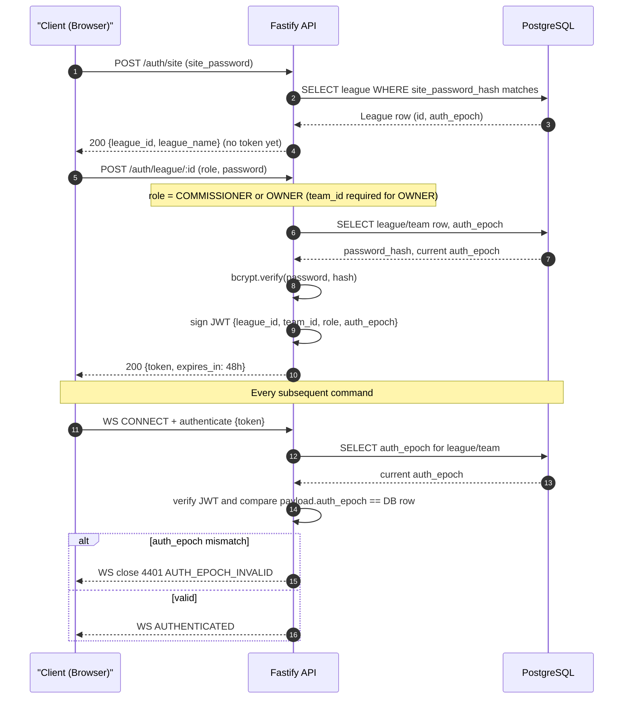
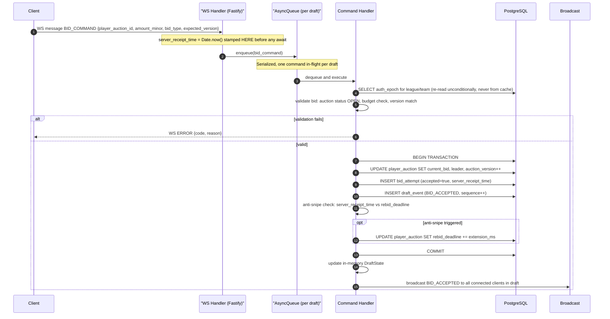
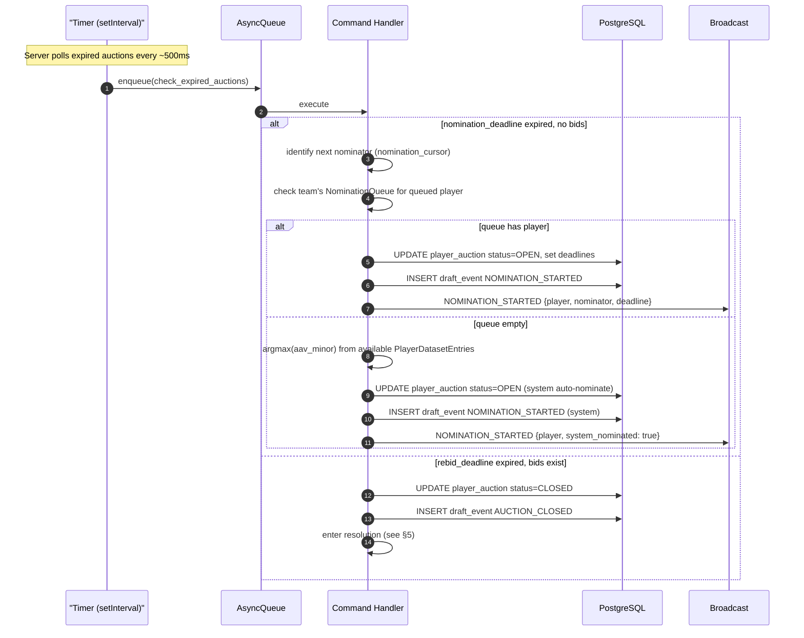
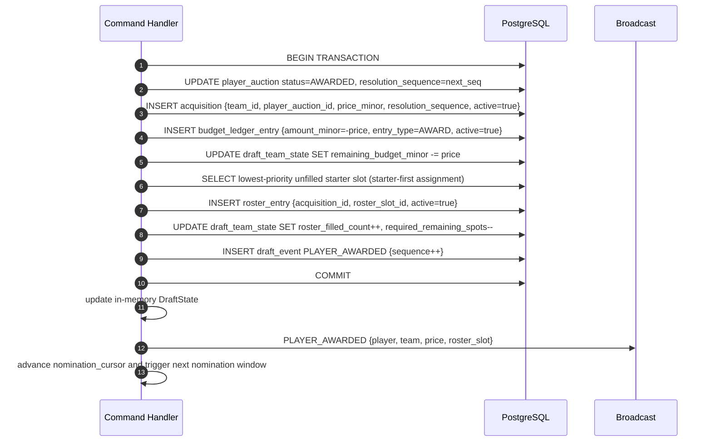
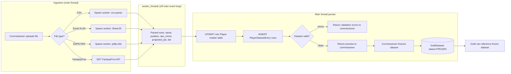
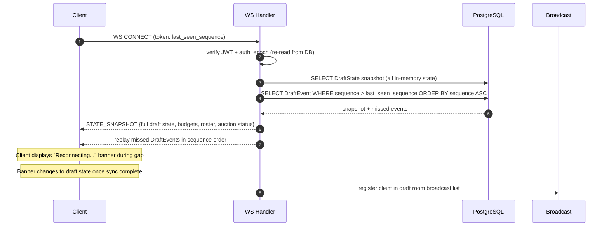
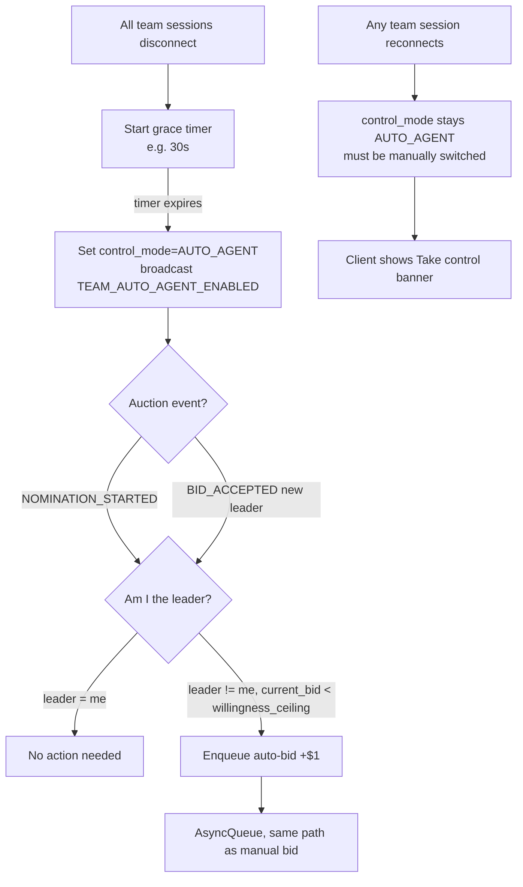
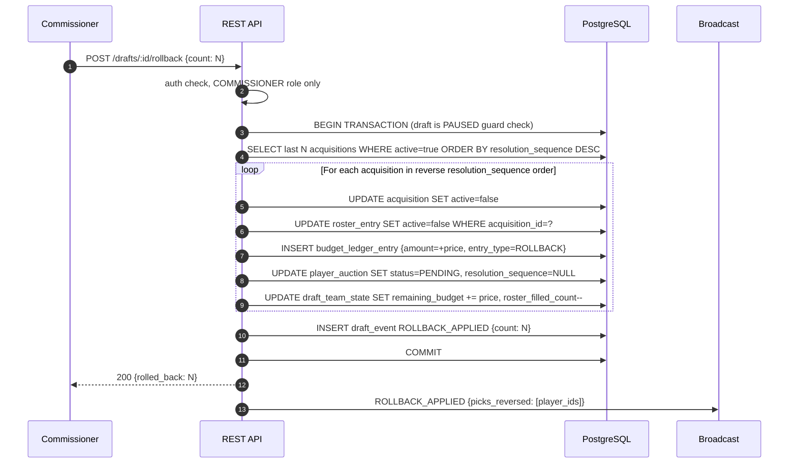

# Application Flow

**Project:** Draft — Fantasy Football Auction Platform
**Date:** 2026-08-31
**Tier:** mvp
**Scope:** Global (one per project)

---

## 1. Overview

The system has three primary runtime flows:

1. **Auth flow** — site password → league → team/commissioner token
2. **Auction command flow** — bid, nomination, resolution (the hot path; p99 < 200ms target)
3. **Dataset import flow** — CSV/Excel/PDF parsed off-thread into a versioned frozen dataset

All mutating commands for a draft route through that draft's per-draft serialized AsyncQueue. No command is broadcast before its DB transaction commits.

---

## 2. Authentication Flow

Three-tier password model. No account creation; passwords are pre-configured by the commissioner.

**auth_epoch** is re-read from the DB on every command handler (not cached from the token payload). Bumping `auth_epoch` (password change or explicit revoke) instantly invalidates all previously issued tokens.

---

## 3. Bid Command Flow (Hot Path)

This is the highest-frequency and highest-latency-sensitivity path. The entire flow from WS receipt to broadcast must complete in < 200ms p99.

**Key invariants enforced here:**
- `server_receipt_time` stamped before any `await`
- DB transaction wraps the update + bid_attempt INSERT + draft_event INSERT atomically
- In-memory state updated AFTER commit, never before
- Broadcast happens AFTER commit

---

## 4. Nomination and Timer Expiry Flow

---

## 5. Resolution Flow (Award + Ledger + Roster)

**Roster assignment rule:** deterministic — lowest `priority` number among unfilled starter slots first, then bench. Never reshuffles prior assignments.

---

## 6. Dataset Import Flow

All parsing is off the main event loop via `node:worker_threads`. The dataset is FROZEN before a draft can reference it; a FROZEN dataset is immutable.

---

## 7. Session Reconnect Flow

A client reconnecting after a disconnect receives a full state snapshot and replays any missed `DraftEvent` rows.

**Crash recovery:** On server restart, any `RUNNING` draft is set to `PAUSED` before the WS server accepts connections. Commissioners resume explicitly. This prevents a late-firing deadline from being applied against stale in-memory state.

---

## 8. Auto-Agent Flow

Auto-Agent does NOT auto-resume manual mode on reconnect. The owner sees a banner and explicitly takes control. All mode transitions are audited as DraftEvents.

---

## 9. Rollback Flow (Commissioner)

**Constraint:** rollback requires the draft to be PAUSED first. Undoes picks in strict reverse `resolution_sequence` order as one all-or-nothing transaction.

---

## 10. External Integration Surface

| System | Direction | Mechanism | When |
|--------|-----------|-----------|------|
| FantasyPros API | Inbound | REST GET (main thread) | Dataset import, triggered by commissioner |
| ESPN PDF | Inbound | File upload → pdfjs-dist in worker_thread | Dataset import |
| Excel/CSV | Inbound | File upload → SheetJS / node:readline in worker_thread | Dataset import |
| SendGrid | Outbound | REST POST (fire-and-forget) | Post-draft — summary email to all owners |
| ESPN (worksheet) | Outbound | File download (generated server-side) | Post-draft — commissioner downloads |
| Railway PostgreSQL | Inbound | postgres.js pool (DATABASE_URL) | All persistence |
| Railway platform | n/a | NODE_ENV, RAILWAY_PUBLIC_DOMAIN env vars | Service coordination |

---

## Provenance

| Section | Origin | Source |
|---------|--------|--------|
| Overview | Inherited | `decision-registry.yaml` → `concurrency-model`, `bid-latency-target`, `state-management-model` |
| Authentication Flow | Inherited | `knowledge/PRD.md` (§4.4 Auth model), `decision-registry.yaml` → `password-hashing`, `jwt-signing` |
| Bid Command Flow | Inherited | `knowledge/state-machine-flows.md` (§4 bid atomicity, §26 command queue), `discuss-prd.md` (Architectural Constraints) |
| Nomination/Timer Expiry | Inherited | `knowledge/state-machine-flows.md` (§8 nomination timers), `decision-registry.yaml` → `empty-nomination-queue` |
| Resolution Flow | Inherited | `knowledge/state-machine-flows.md` (§10 resolution), `knowledge/PRD.md` (§7 roster assignment) |
| Dataset Import Flow | Inherited | `decision-registry.yaml` → `csv-parsing-worker`, `pdf-parsing-library`, `phase2b-adapters` |
| Session Reconnect Flow | Inherited | `decision-registry.yaml` → `ws-reconnect-strategy`, `session-state-location`, `crash-recovery-ux` |
| Auto-Agent Flow | Inherited | `knowledge/state-machine-flows.md` (§24 Auto-Agent), `knowledge/PRD.md` (§Auto-Agent transitions) |
| Rollback Flow | Inherited | `knowledge/PRD.md` (§31 corrections/rollback), `knowledge/data-model.md` (§17.5) |
| External Integration Surface | Inherited | `discuss-prd.md` (Integration Surface table), `decision-registry.yaml` → `phase2b-adapters` |
