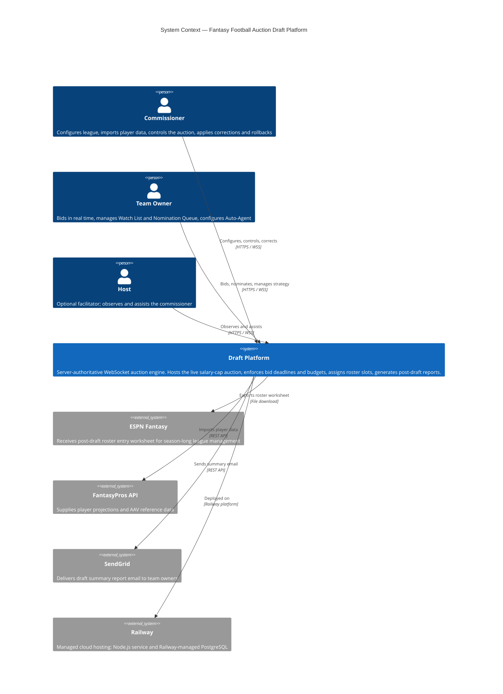
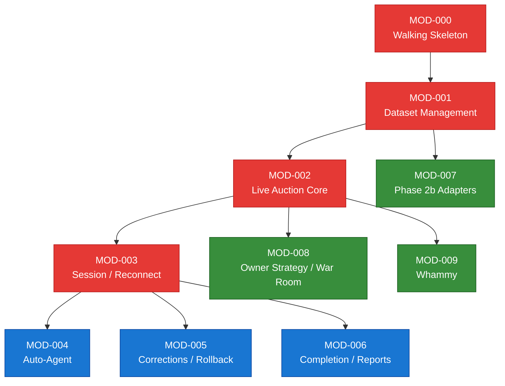

# Architecture Overview

**Project:** Draft — Fantasy Football Auction Platform
**Date:** 2026-08-31
**Tier:** mvp
**Scope:** Global (one per project)

---

## 1. System Context (C4 Level 1)

### Context Diagram



### System Boundaries

| Boundary | Inside | Outside |
|----------|--------|---------|
| In scope | Live auction engine, auth, roster assignment, budget enforcement, corrections/rollback, Auto-Agent, reports | Season-long league management, trade processing, waiver wires, scoring |
| In scope | Player dataset management (CSV, Excel, PDF, FantasyPros ingestion) | Live player stats, injury feeds, real-time NFL data |
| In scope | Post-draft ESPN worksheet and summary email | ESPN API write-back (ESPN does not expose a roster-import API) |
| Out of scope | AI/ML valuation, fair-value recommendations | Per PRD §3.2 and CLAUDE.md constraint #6 |

---

## 2. Architecture Style & Key Decisions

**Style: Modular Monolith** — a single Node.js process hosts all concerns (HTTP, WebSocket, auction logic, auth) backed by a single PostgreSQL instance. No microservices, no message broker, no separate worker processes except `node:worker_threads` for CPU-bound file parsing.

**Concurrency model: Per-draft serialized in-memory command queue** — `Map<draft_id, AsyncQueue>`. One command in-flight per draft at a time. This is the primary concurrency guard, not Postgres row locks.

| Decision | Chosen | Rationale | Registry Slug |
|----------|--------|-----------|---------------|
| Runtime | Node.js 20+ LTS + TypeScript | Explicit stack choice; type safety across server/client via shared-types | `backend-language` |
| HTTP framework | Fastify 4.x | Native Pino logger, JWT plugin, rate-limit plugin, WebSocket upgrade handler | `backend-framework` |
| Realtime | native ws 8.x + sequence-numbered envelope | No Socket.io overhead; envelope defined in shared-types from Phase 0 | `realtime-transport` |
| Database | PostgreSQL 15+ | State-stored model; rows are live authority; DraftEvent log is audit only | `primary-database` |
| ORM | Drizzle (postgres.js driver) | Hybrid: raw SQL for resolution transaction; query builder for CRUD | `drizzle-query-style` |
| Frontend | React 18 + Vite 5 + TypeScript | Explicit stack choice; Vite consistent with server-side TypeScript | `frontend-framework` |
| Validation | Zod 3.x via shared-types | Single source of truth for WS and REST shapes shared between FE and BE | `validation-library` |
| Auth | Password-based + HMAC JWT + auth_epoch revocation | Private app; no third-party IdP; auth_epoch re-read from DB on every command | `jwt-signing` |
| Deployment | Two Railway services: Node.js + Railway Postgres | Native Railway pattern; managed backups, auto-injected DATABASE_URL | `railway-topology` |
| Observability | Pino + pino-opentelemetry-transport | Fastify-native logger; OTel-compatible; bid_pipeline_duration_ms histogram | `observability-impl` |

### Design Principles

1. **Server is the only source of truth.** Client countdown timers and displayed prices are display-only. `server_receipt_time` (stamped before any `await`) is the anti-sniping authority.
2. **Append-only, never delete.** Compensating rows (`active: false`) supersede; the history is always queryable.
3. **Money is integers.** All `*_minor` fields are cents. No floating point anywhere.
4. **Serialize per draft, not per table.** The in-memory AsyncQueue prevents interleaved commands without Postgres advisory locks.
5. **Fail loud, never silently correct.** Rejected bids, failed ledger replays, and parse errors surface immediately with context. The server never silently adjusts a user's entered amount.

---

## 3. Backend / Frontend Split

| Layer | Technology | Responsibility |
|-------|-----------|----------------|
| Frontend (web/) | React 18 + Vite 5 + TypeScript | All UI screens; WS client; countdown rendering from server-sent deadline_ts |
| Backend (server/) | Node.js 20 + Fastify 4.x + TypeScript | HTTP REST API, WS server, auction engine, auth, dataset management, reports |
| Shared types (shared-types/) | TypeScript + Zod 3.x | WS envelope schema, all command/event shapes, REST request/response types |
| Data | PostgreSQL 15 + Drizzle ORM | Persistent state; append-only audit log; migration-managed schema |
| File parsing | node:worker_threads | CPU-bound CSV, PDF (pdfjs-dist), and Excel (SheetJS) parsing off main event loop |

---

## 4. Module Map & DAG

| Module | Name | Demo Criteria | Depends On |
|--------|------|---------------|------------|
| MOD-000 | walking-skeleton | Server boots, /health responds 200 | — |
| MOD-001 | player-dataset-management | Commissioner freezes a dataset | MOD-000 |
| MOD-002 | live-auction-core | 12 teams bid; player awarded correctly | MOD-001 |
| MOD-003 | session-reconnect-multi-draft | Reconnect restores exact state | MOD-002 |
| MOD-004 | auto-agent | Disconnected team bids automatically | MOD-003 |
| MOD-005 | corrections-and-rollback | Price corrected; rollback reverses pick | MOD-003 |
| MOD-006 | draft-completion-and-reports | ESPN worksheet exported; email sent | MOD-003 |
| MOD-007 | phase2b-data-adapters | ESPN PDF, FantasyPros, Excel imported | MOD-001 |
| MOD-008 | owner-strategy-and-war-room | War Room synced; Target Values private | MOD-002 |
| MOD-009 | whammy | Whammy fires; budget updates | MOD-002 |

### Dependency Graph



**Legend:** Red = highest-risk sequential core | Blue = sequential post-core | Green = parallelizable

### Critical Path

MOD-000 → MOD-001 → MOD-002 → MOD-003 is the longest and highest-risk chain. MOD-002 (live-auction-core) is the highest-complexity module: per-draft command queue, bid atomicity, PlayerAuction FSM, anti-sniping, and resolution transaction all live here. MOD-003 adds session resilience on top. These four modules must be production-quality before any parallel modules begin.

---

## 5. Cross-Cutting Concerns

| Concern | Strategy | Owner |
|---------|----------|-------|
| Authentication | HMAC JWT (@fastify/jwt); auth_epoch re-read from DB in preHandler on every command | MOD-000 |
| Authorization | league_id mismatch rejection per command (two independent checks: routing + auth layer) | MOD-000 |
| Password hashing | @node-rs/bcrypt, work factor 12; site/league/team passwords hashed at creation | MOD-000 |
| Rate limiting | @fastify/rate-limit, in-memory, 5 failures/IP/min on auth routes | MOD-000 |
| Structured logging | Pino (Fastify-native); pino-opentelemetry-transport; all logs are structured JSON | MOD-000 |
| Metrics | OTel histogram: `bid_pipeline_duration_ms` (p99 < 200ms target) | MOD-002 |
| Error handling | Fastify error handler returns `{code, message}` JSON; WS command rejections return `{type: "ERROR", code, reason}` | MOD-000 |
| Configuration | Env checker at boot validates all required vars; fails with ERR_CDR_78_EX_CONFIG naming every missing var | MOD-000 |
| Secrets | Railway env vars (production); .env git-ignored (local dev); no secrets in code | MOD-000 |
| File parsing | node:worker_threads for all CPU-bound CSV/PDF/XLSX work; never blocks main event loop | MOD-001 / MOD-007 |
| Money arithmetic | All calculations server-side using integer cents (`*_minor`); no floating point | MOD-002 |

---

## 6. Non-Goals & Scope Boundaries

| Non-Goal | Rationale |
|----------|-----------|
| Season-long league management (trades, waivers, scoring, standings) | PRD §3.2 explicitly out of scope; ESPN handles this |
| AI/ML player valuation, fair-value recommendations, or blended AAV computation | PRD constraint #6; AAVs are static reference data only |
| Real-time NFL player stats or injury feeds | No live data provider integration; player data is frozen at dataset import time |
| ESPN API write-back for roster import | ESPN does not expose a public roster-import API; output is a formatted worksheet for manual entry |
| Multi-region / globally distributed deployment | Railway single-region MVP; no Anycast or CDN for WS |
| Push notifications (mobile) | Not needed for a 12-team draft where all participants are at their devices |
| Redis / message broker | Ruled out at discuss phase; single Railway instance + in-memory queue is sufficient |
| Arbitrary-point rollback (time-travel) | Bounded rollback only: last N picks in reverse resolution_sequence order |
| Automated player valuation / draft recommendations | No strategic valuation by design |

---

## 7. Folder Structure

```
Draft/                          # monorepo root
├── server/                     # Node.js + Fastify backend
│   ├── src/
│   │   ├── main.ts             # entry point: env check, Fastify init, crash recovery
│   │   ├── auth/               # login, JWT, auth_epoch, rate limiting
│   │   ├── league/             # League, Team, Membership CRUD; config endpoints
│   │   ├── player/             # DraftDataset lifecycle; ingestion adapters
│   │   │   └── adapters/       # csv.ts, espn-pdf.ts, fantasypros.ts, excel.ts
│   │   ├── draft/              # auction engine; command queue; FSMs; resolution
│   │   │   ├── command-queue.ts
│   │   │   ├── nomination.ts
│   │   │   ├── bid.ts
│   │   │   ├── resolution.ts
│   │   │   └── auto-agent.ts
│   │   ├── session/            # DraftClientSession; WS reconnect; snapshot
│   │   └── reports/            # DraftSummaryReport; ESPN worksheet; SendGrid
│   ├── db/
│   │   └── schema/             # Drizzle schema (all entities)
│   └── package.json
├── web/                        # React 18 + Vite 5 frontend
│   ├── src/
│   │   ├── screens/
│   │   │   ├── lobby/
│   │   │   ├── draft-room/
│   │   │   ├── war-room/
│   │   │   ├── commissioner/
│   │   │   └── draft-board/
│   │   └── ws/                 # WS client; reconnect; state management
│   └── package.json
├── shared-types/               # Zod schemas; WS envelope; shared TS types
│   ├── src/
│   │   ├── protocol.ts         # WS envelope + all command/event types
│   │   └── schemas/            # Zod validators for all shapes
│   └── package.json
├── .aah/                       # AAH harness artifacts
├── knowledge/                  # Design documents (PRD, data-model, etc.)
├── railway.toml                # Railway two-service deploy config
├── package.json                # npm workspaces root
└── .github/workflows/ci.yml   # tsc + Vitest on PR; Railway deploy on merge
```

---

## Provenance

| Section | Origin | Source |
|---------|--------|--------|
| System Context | Inherited + Authored | `discuss-prd.md` (Integration Surface), `project-intent.yaml` (end_users, integration_surface) |
| Architecture Style & Key Decisions | Inherited | `decision-registry.yaml` → `backend-language`, `backend-framework`, `realtime-transport`, `primary-database`, `drizzle-query-style`, `jwt-signing`, `railway-topology`, `observability-impl` |
| Design Principles | Inherited | `discuss-prd.md` (Architectural Constraints), `decision-registry.yaml` → `concurrency-model`, `money-representation`, `state-management-model` |
| Backend / Frontend Split | Inherited | `decision-registry.yaml` → `backend-language`, `frontend-framework`, `validation-library`, `monorepo-structure`, `csv-parsing-worker` |
| Module Map & DAG | Authored | `module-map.yaml` (architecture phase) |
| Cross-Cutting Concerns | Inherited + Authored | `decision-registry.yaml` → `rate-limiter-approach`, `password-hashing`, `jwt-signing`, `secrets-management`, `observability-impl`, `bid-latency-target`; architecture phase |
| Non-Goals & Scope Boundaries | Inherited | `discuss-prd.md` (Solution boundaries), `project-intent.yaml` (constraints), `decision-registry.yaml` → `business-domain`, `technical-archetype` |
| Folder Structure | Authored | `decision-registry.yaml` → `monorepo-structure`; `module-map.yaml` (layers); architecture phase |
