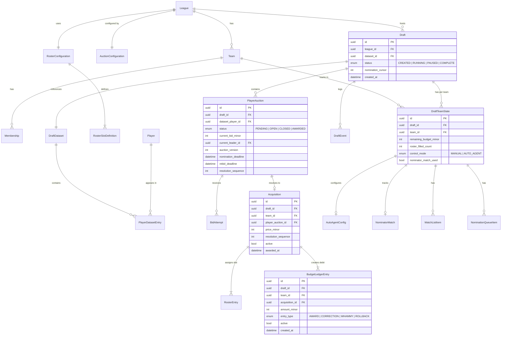
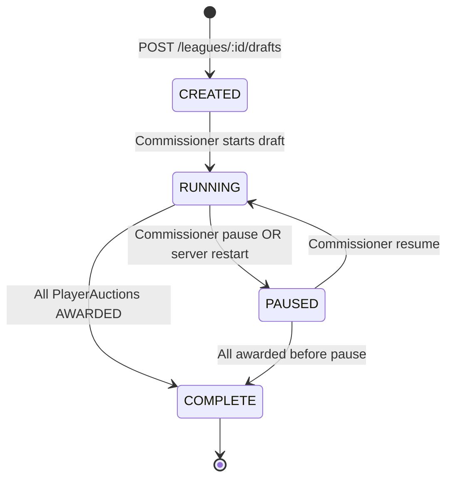
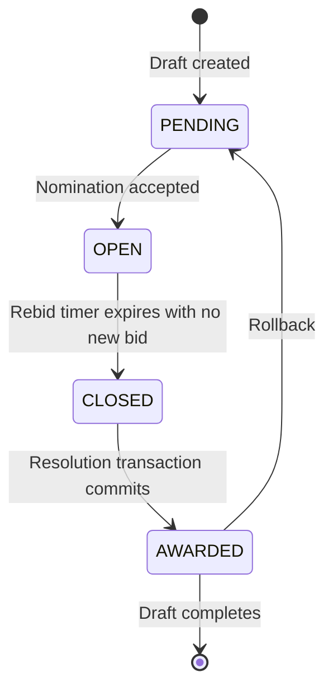

# Data Model

**Project:** Draft — Fantasy Football Auction Platform
**Date:** 2026-08-31
**Tier:** mvp
**Scope:** Global (one per project)

---

## 1. Overview

State-stored model: PostgreSQL rows are the live authority. The `DraftEvent` log is append-only audit + WebSocket reconnect replay only — not a source for arbitrary state reconstruction. Rollback is bounded (last N picks in reverse `resolution_sequence` order); it never requires replaying the full event log.

**Fundamental invariants (see `data-model.md §21` for full list):**
- All money fields are `*_minor` integers (cents). No floating point anywhere.
- Append-only: `Acquisition`, `RosterEntry`, `BudgetLedgerEntry` rows are never deleted. Corrections supersede via `active = false` + new row.
- `resolution_sequence` determines rollback order, not `awarded_at` timestamps.
- `max_legal_bid = remaining_budget_minor - (100 * required_remaining_roster_spots)` — calculated server-side only.
- `DraftTeamState.remaining_budget_minor` must equal the team's initial budget minus the sum of all active `BudgetLedgerEntry` debits for that team in that draft.

---

## 2. Entity Relationship Diagram

---

## 3. Entity Schemas by Bounded Context

### 3.1 League & Configuration

**League**
| Field | Type | Notes |
|-------|------|-------|
| id | uuid PK | |
| name | string | |
| site_password_hash | string | @node-rs/bcrypt |
| commissioner_password_hash | string | |
| commissioner_team_id | uuid FK nullable | set when commissioner owns a team |
| auth_epoch | int | bump to invalidate all tokens for this league |
| created_at | datetime | |

**Team**
| Field | Type | Notes |
|-------|------|-------|
| id | uuid PK | |
| league_id | uuid FK | |
| name | string | |
| team_password_hash | string | |
| auth_epoch | int | bump to invalidate all tokens for this team |
| draft_order | int | nomination turn order |

**Membership** (User-to-Team join)
| Field | Type | Notes |
|-------|------|-------|
| id | uuid PK | |
| user_id | uuid FK | |
| team_id | uuid FK | |
| league_id | uuid FK | |
| role | enum | COMMISSIONER / HOST / OWNER |

**RosterConfiguration**
| Field | Type | Notes |
|-------|------|-------|
| id | uuid PK | |
| league_id | uuid FK UNIQUE | |
| total_roster_size | int | must equal sum(starter_slots) + bench_slots |
| bench_slots | int | |

**RosterSlotDefinition**
| Field | Type | Notes |
|-------|------|-------|
| id | uuid PK | |
| config_id | uuid FK | references RosterConfiguration |
| position | string | QB, RB, WR, TE, FLEX, K, DEF, etc. |
| priority | int | lowest = filled first (starter-first assignment) |
| is_starter | bool | |
| slot_count | int | |

**AuctionConfiguration**
| Field | Type | Notes |
|-------|------|-------|
| id | uuid PK | |
| league_id | uuid FK UNIQUE | |
| initial_budget_minor | int | per-team starting budget (cents) |
| nomination_timer_ms | int | |
| second_bid_timer_ms | int | timer after first competing bid |
| rebid_timer_ms | int | timer after each subsequent bid |
| anti_snipe_threshold_ms | int | bid in last N ms triggers extension |
| anti_snipe_extension_ms | int | extends rebid deadline by this amount |
| min_bid_minor | int | default 100 (= $1.00) |

### 3.2 Player Dataset

**DraftDataset**
| Field | Type | Notes |
|-------|------|-------|
| id | uuid PK | |
| league_id | uuid FK | |
| draft_id | uuid FK nullable | set when attached to a draft |
| status | enum | DRAFT / VALIDATED / FROZEN |
| frozen_at | datetime nullable | |
| version | int | incremented on each import |

**Player** (master table)
| Field | Type | Notes |
|-------|------|-------|
| id | uuid PK | |
| name | string | |
| position | string | |
| nfl_team | string | |
| espn_player_id | string nullable | for ESPN worksheet generation |

**PlayerDatasetEntry** (join: dataset + player + stats)
| Field | Type | Notes |
|-------|------|-------|
| id | uuid PK | |
| dataset_id | uuid FK | |
| player_id | uuid FK | |
| aav_minor | int | Average Auction Value (cents); static reference data |
| projected_points | decimal nullable | |
| tier | int nullable | |
| source | string | CSV / ESPN_PDF / FANTASYPROS / EXCEL |

### 3.3 Draft & Auction

**Draft**
| Field | Type | Notes |
|-------|------|-------|
| id | uuid PK | |
| league_id | uuid FK | multi-draft isolation key |
| dataset_id | uuid FK | references FROZEN DraftDataset |
| status | enum | CREATED / RUNNING / PAUSED / COMPLETE |
| nomination_cursor | int | current nominator's draft_order index |
| started_at | datetime nullable | |
| completed_at | datetime nullable | |

**DraftTeamState** (one per team per draft; mutable; mirrors Postgres rows)
| Field | Type | Notes |
|-------|------|-------|
| id | uuid PK | |
| draft_id | uuid FK | |
| team_id | uuid FK | |
| remaining_budget_minor | int | derived from ledger; must be kept in sync |
| roster_filled_count | int | |
| required_remaining_spots | int | used for max_legal_bid calculation |
| control_mode | enum | MANUAL / AUTO_AGENT |
| connected_at | datetime nullable | last connection timestamp |

**PlayerAuction** (one per player per draft)
| Field | Type | Notes |
|-------|------|-------|
| id | uuid PK | |
| draft_id | uuid FK | |
| dataset_player_id | uuid FK | |
| status | enum | PENDING / OPEN / CLOSED / AWARDED |
| current_bid_minor | int | 0 when PENDING |
| current_leader_id | uuid FK nullable | team currently leading |
| auction_version | int | incremented on every bid; used for stale-state rejection |
| nomination_deadline | datetime nullable | |
| rebid_deadline | datetime nullable | |
| anti_snipe_extension_count | int | number of extensions applied |
| resolution_sequence | int nullable | set when AWARDED; determines rollback order |
| nominator_team_id | uuid FK | team that nominated this player |

**BidAttempt** (append-only; all accepted + rejected)
| Field | Type | Notes |
|-------|------|-------|
| id | uuid PK | |
| draft_id | uuid FK | |
| player_auction_id | uuid FK | |
| team_id | uuid FK | |
| bid_amount_minor | int | |
| bid_type | enum | ABSOLUTE / RELATIVE / NOMINATOR_MATCH |
| expected_current_bid_minor | int nullable | for stale-state protection on RELATIVE bids |
| expected_auction_version | int nullable | |
| server_receipt_time | datetime | stamped before any await in WS handler |
| accepted | bool | |
| rejection_reason | string nullable | |

**DraftEvent** (append-only audit log)
| Field | Type | Notes |
|-------|------|-------|
| id | uuid PK | |
| draft_id | uuid FK | |
| sequence | int | allocated atomically in same transaction as row effect |
| event_type | string | BID_ACCEPTED, PLAYER_AWARDED, NOMINATION_STARTED, etc. |
| team_id | uuid FK nullable | |
| player_auction_id | uuid FK nullable | |
| payload | jsonb | full event payload |
| created_at | datetime | |

### 3.4 Resolution & Ledger

**Acquisition** (append-only; one per awarded pick; active=false when superseded/rolled back)
| Field | Type | Notes |
|-------|------|-------|
| id | uuid PK | |
| draft_id | uuid FK | |
| team_id | uuid FK | |
| player_auction_id | uuid FK | |
| price_minor | int | final award price |
| resolution_sequence | int | strict integer for rollback ordering |
| active | bool | false = superseded or rolled back (never deleted) |
| awarded_at | datetime | |

**RosterEntry** (append-only; active=false on rollback)
| Field | Type | Notes |
|-------|------|-------|
| id | uuid PK | |
| acquisition_id | uuid FK | |
| draft_id | uuid FK | |
| team_id | uuid FK | |
| roster_slot_id | uuid FK | references RosterSlotDefinition |
| active | bool | |
| assigned_at | datetime | |

**BudgetLedgerEntry** (append-only; compensating rows on correction/rollback)
| Field | Type | Notes |
|-------|------|-------|
| id | uuid PK | |
| draft_id | uuid FK | |
| team_id | uuid FK | |
| acquisition_id | uuid FK nullable | null for WHAMMY entries |
| amount_minor | int | negative = debit |
| entry_type | enum | AWARD / CORRECTION / WHAMMY / ROLLBACK |
| active | bool | false = superseded |
| created_at | datetime | |

### 3.5 Auto-Agent & Strategy

**AutoAgentConfig**
| Field | Type | Notes |
|-------|------|-------|
| id | uuid PK | |
| draft_id | uuid FK | |
| team_id | uuid FK | |
| willingness_pct | decimal | 0.0-1.0; max bid = willingness_pct * remaining_budget |
| enabled | bool | |
| last_transition_at | datetime | |

**NominatorMatch** (one per team per draft)
| Field | Type | Notes |
|-------|------|-------|
| id | uuid PK | |
| draft_id | uuid FK | |
| team_id | uuid FK | |
| used | bool | set true on use; never reset |
| used_at | datetime nullable | |

**WatchListItem**
| Field | Type | Notes |
|-------|------|-------|
| id | uuid PK | |
| draft_id | uuid FK | |
| team_id | uuid FK | |
| dataset_player_id | uuid FK | |
| created_at | datetime | |
- Never triggers automatic nomination

**NominationQueueItem**
| Field | Type | Notes |
|-------|------|-------|
| id | uuid PK | |
| draft_id | uuid FK | |
| team_id | uuid FK | |
| dataset_player_id | uuid FK | |
| queue_position | int | ordered; lowest position nominated first |

**OwnerTargetValue** (private; never broadcast)
| Field | Type | Notes |
|-------|------|-------|
| id | uuid PK | |
| draft_id | uuid FK | |
| team_id | uuid FK | |
| dataset_player_id | uuid FK | |
| target_value_minor | int | |

---

## 4. State Machines

### Draft FSM

### PlayerAuction FSM

---

## 5. Key Invariants (selected; full list in `data-model.md §21`)

| # | Invariant |
|---|-----------|
| I-01 | `remaining_budget_minor` cannot go below the cents reserve for required remaining roster spots |
| I-02 | `total_roster_size == sum(starter_slots) + bench_slots` must hold at AuctionConfiguration save time |
| I-03 | `resolution_sequence` values within a draft must be strictly monotonically increasing |
| I-04 | A FROZEN dataset cannot be modified; all PlayerAuctions reference immutable player data |
| I-05 | `Acquisition`, `RosterEntry`, `BudgetLedgerEntry` are never hard-deleted; only `active` toggled |
| I-06 | `DraftEvent.sequence` and its row effects always commit in the same transaction |
| I-07 | `auth_epoch` in every preHandler must match the current value in the DB row (not just the token) |
| I-08 | Rollback undoes picks in strict reverse `resolution_sequence` order as one all-or-nothing transaction |
| I-09 | In-place price correction is rejected if replaying the team's ledger forward from that pick finds any later pick becoming illegal |
| I-10 | `server_receipt_time` is stamped as the first line in the WS message handler, before any `await` |

---

## 6. Storage & Migration

| Concern | Decision |
|---------|----------|
| Driver | postgres.js (native recommended Drizzle driver) |
| ORM | Drizzle (query builder for CRUD; raw `sql` tag for resolution transaction) |
| Migration tool | Drizzle Kit (`drizzle-kit generate` + `drizzle-kit migrate`) |
| Connection pool | postgres.js built-in, max 10 connections |
| Hosted on | Railway-managed PostgreSQL 15 (auto-backups, point-in-time recovery) |
| Connection URL | `DATABASE_URL` env var injected by Railway |

---

## Provenance

| Section | Origin | Source |
|---------|--------|--------|
| Overview | Inherited | `knowledge/BUILD_PLAN.md` (Recovery model, Rollback and correction model), `discussion-registry.yaml` → `state-management-model`, `rollback-strategy` |
| Entity Relationship Diagram | Inherited + Authored | `knowledge/data-model.md` (full entity schemas), architecture phase (diagram generation) |
| Entity Schemas | Inherited | `knowledge/data-model.md` (§2-§17 entity definitions by bounded context) |
| State Machines | Inherited | `knowledge/state-machine-flows.md` (§3 Draft FSM, §5 PlayerAuction FSM) |
| Key Invariants | Inherited | `knowledge/data-model.md` (§21 invariants checklist) |
| Storage & Migration | Inherited | `decision-registry.yaml` → `primary-database`, `db-migration-tool`, `postgres-pool`, `railway-topology` |
