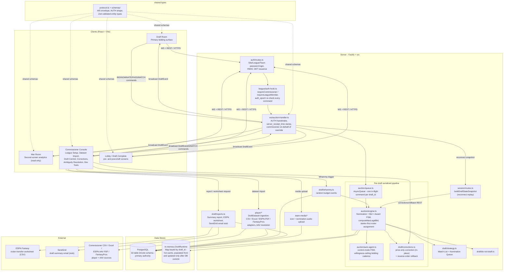

# System Architecture

## Overview

A fantasy-football auction draft platform: real-time server-authoritative salary-cap auction across 12 teams, WebSocket-driven, with post-draft roster transfer to ESPN. One deployment may host multiple concurrent league drafts in isolation (keyed by `draft_id`, re-checked against `league_id` on every command). The server owns all auction state; the client is a display + input terminal. Implemented as a Node.js/Fastify monolith (state-stored, not event-sourced) against a single PostgreSQL database.

## Architecture Diagram

## Layer Summary

| Layer | Purpose | Key Components |
|-------|---------|----------------|
| Client | Display + input terminal | Draft Room, War Room, Commissioner Console, Lobby, Draft Complete |
| Shared types | WS protocol contract + Zod validation | `protocol.ts`, `schemas/` |
| Auth | Token issuance + `auth_epoch` re-check on every command | `auth/routes.ts`, `league/auth-hook.ts` |
| WS Handler | Per-draft connection routing, AUTH handshake, `server_receipt_time` stamping | `ws/auction-handler.ts` |
| Command Queue | Serialized mutation pipeline (one in-flight per draft) | `auction/queue.ts` (`AsyncQueue`) |
| Auction Core | Nomination FSM, bid atomicity, resolution, ledger, starter-first roster assignment | `auction/engine.ts` |
| Auto-Agent | Automated bidder/nominator on disconnect, willingness-ceiling cadence | `auction/auto-agent.ts` |
| Corrections | Price correction (in-place) + rollback (reverse `resolution_sequence` order) | `draft/corrections.ts` |
| Whammy | Random budget/entertainment events flowing through the ledger | `draft/whammy.ts` |
| Strategy / Lists | Watch List, Nomination Queue, Do Not Draft | `draft/strategy.ts`, `draft/do-not-draft.ts` |
| Player Ingestion | Player/AAV data import, pre-draft only | `player/*` (CSV, Excel, ESPN-PDF, FantasyPros adapters), `aav-resolution.ts` |
| Reports | Draft summary, ESPN worksheet, SendGrid email stub | `draft/reports.ts` |
| Session | Reconnect snapshot + missed-event replay | `session/routes.ts` |
| PostgreSQL | Authoritative state + `draft_events` audit log | 32-table Drizzle schema (`server/db/schema/index.ts`) |

## External Integrations

- Commissioner CSV / Excel import (player data / AAVs / projections)
- ESPN AAV PDF import (`espn-pdf.ts` adapter, `espn-pdf-worker.ts`)
- FantasyPros adapter (`fantasypros.ts`) — multi-source AAV resolution via `aav-resolution.ts`
- ESPN roster-transfer worksheet export (CSV, `GET /drafts/:draftId/espn-worksheet`)
- SendGrid email stub for Draft Summary Reports (`POST /drafts/:draftId/report/email`)
- Railway deployment (Node app service + managed PostgreSQL, `railway.toml`)
