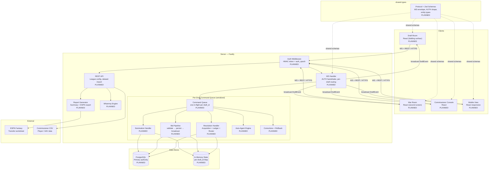

# System Architecture

> **Note:** Pre-implementation. All components are `[PLANNED]` and derived from design documents.

## Overview

A fantasy-football auction draft platform: real-time server-authoritative salary-cap auction across 12 teams, WebSocket-driven, with post-draft roster transfer to ESPN. One deployment may host multiple concurrent league drafts in isolation. The server owns all auction state; the client is a display + input terminal.

## Architecture Diagram

## Layer Summary

| Layer | Purpose | Key Components |
|-------|---------|----------------|
| Client | Display + input terminal | Draft Room, War Room, Commissioner Console, Mobile View [PLANNED] |
| Shared types | WS protocol contract + Zod validation | protocol.ts, entity types [PLANNED] |
| Auth | Token issuance + epoch validation on every command | HMAC tokens, auth_epoch check [PLANNED] |
| REST API | League setup, dataset import, reports | Fastify routes [PLANNED] |
| WS Handler | Per-draft connection routing, AUTH handshake | ws server, 5s auth timeout [PLANNED] |
| Command Queue | Serialized mutation pipeline (one in-flight per draft) | In-memory queue per draft_id [PLANNED] |
| Draft Core | Nomination FSM, bid atomicity, resolution, ledger, roster | Per-draft state machine [PLANNED] |
| Auto-Agent | Automated bidder / nominator on disconnect | Cadence engine [PLANNED] |
| Corrections | Price correction (in-place) + rollback (reverse order) | CommissionerAction [PLANNED] |
| Whammy | Random budget events with commissioner approval gate | WhammyEvent, ledger entries [PLANNED] |
| Reports | Draft summary, per-team report, ESPN worksheet | DraftSummaryReport [PLANNED] |
| PostgreSQL | Authoritative state + DraftEvent audit log | All entities [PLANNED] |

## External Integrations

- Commissioner CSV import (player data / AAVs / projections) [PLANNED]
- ESPN AAV PDF import [PLANNED]
- FantasyPros / Sleeper / nflverse adapters (Phase 2b) [PLANNED]
- ESPN roster-transfer worksheet (Phase 9) [PLANNED]
- Email delivery for Draft Summary Reports — SendGrid stub (Phase 9) [PLANNED]
