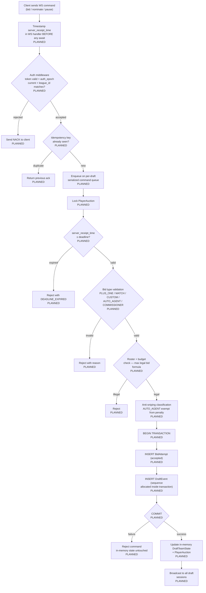
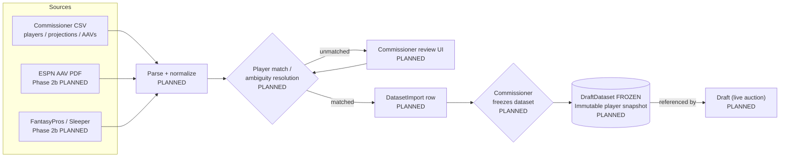
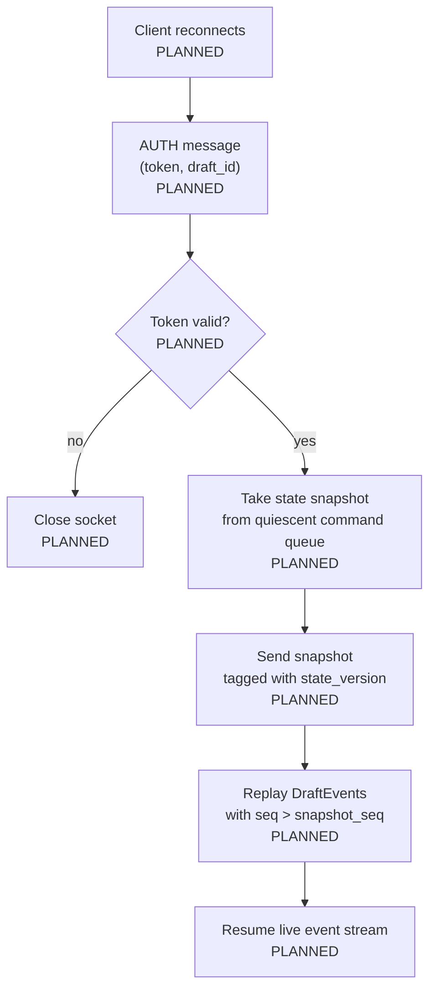

# Data Flow

> **Note:** Pre-implementation. All flows are `[PLANNED]`.

## Overview

Three primary data flows: (1) the bid atomicity pipeline — the hottest and most invariant-sensitive path; (2) ingestion — player data loaded pre-draft into a frozen DraftDataset; (3) reconnect replay — snapshot + missed-event catch-up on WS reconnect.

## Bid Atomicity Pipeline (primary runtime flow)

## Data Ingestion Pipeline (pre-draft)

## WS Reconnect Replay

## Data Pipelines

| Pipeline | Source | Processing | Destination |
|----------|--------|-----------|-------------|
| Bid atomicity | WS command | Auth → dedup → queue → validate → tx | PostgreSQL + in-memory + WS broadcast [PLANNED] |
| Player ingestion | CSV / PDF / API | Parse → match → review → freeze | DraftDataset (PostgreSQL) [PLANNED] |
| WS reconnect | Reconnecting client | Snapshot + event replay | Client WS stream [PLANNED] |
| Nomination turn | Draft timer / owner action | FSM transition → create PlayerAuction | PostgreSQL + WS broadcast [PLANNED] |
| Auction resolution | Deadline expiry | Acquire → debit ledger → assign roster | Acquisition, RosterEntry, BudgetLedgerEntry [PLANNED] |
| Auto-Agent bid | Leadership change / auction open | Willingness calc → +$1 bid via Phase 3 pipeline | Same as bid atomicity [PLANNED] |
| Rollback | Commissioner action | Reverse-order undo → compensating rows | Superseded Acquisition / RosterEntry / Ledger entries [PLANNED] |
| Draft summary | Draft COMPLETE | Integrity check → report generation (off main loop) | DraftSummaryReport + optional email [PLANNED] |

## Integration Points

- **Inbound:** Commissioner CSV upload (player master + AAVs) [PLANNED]
- **Inbound:** ESPN AAV PDF (Phase 2b) [PLANNED]
- **Inbound:** FantasyPros / Sleeper / nflverse (Phase 2b) [PLANNED]
- **Outbound:** WS broadcast to all connected draft sessions per event [PLANNED]
- **Outbound:** ESPN entry-order worksheet (Phase 9) [PLANNED]
- **Outbound:** SendGrid email for draft summary reports (Phase 9, stub first) [PLANNED]
