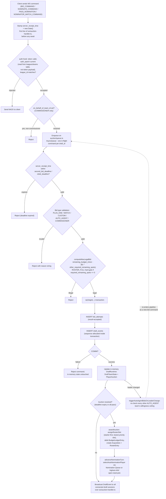
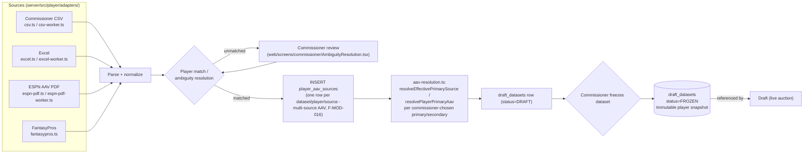
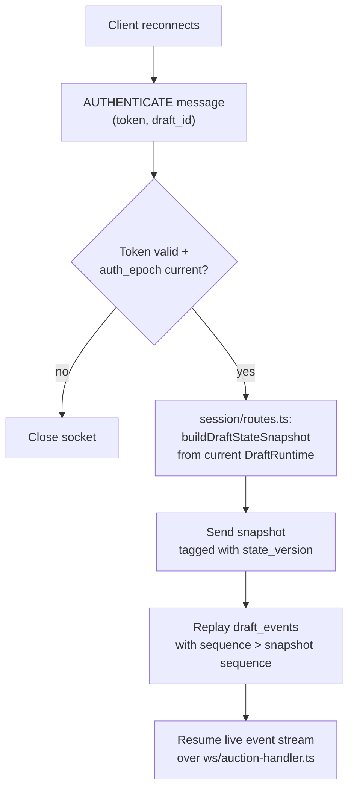

# Data Flow

## Overview

Three primary data flows, all implemented: (1) the bid atomicity pipeline — the hottest and most invariant-sensitive path, in `server/src/auction/engine.ts` + `ws/auction-handler.ts`; (2) ingestion — player/AAV data loaded pre-draft via CSV/Excel/ESPN-PDF/FantasyPros adapters into a frozen DraftDataset; (3) reconnect replay — snapshot + missed-event catch-up via `session/routes.ts` on WS reconnect.

## Bid Atomicity Pipeline (primary runtime flow)

## Data Ingestion Pipeline (pre-draft)

## WS Reconnect Replay

## Data Pipelines

| Pipeline | Source | Processing | Destination |
|----------|--------|-----------|-------------|
| Bid atomicity | WS command | Auth (auth_epoch) → on-behalf-of resolve → per-draft queue → deadline/type/roster-budget validate → tx | PostgreSQL + in-memory DraftRuntime + WS broadcast |
| Player ingestion | CSV / Excel / ESPN PDF / FantasyPros | Parse → match → review → multi-source AAV resolve → freeze | `draft_datasets` + `player_aav_sources` (PostgreSQL) |
| WS reconnect | Reconnecting client | Snapshot (`buildDraftStateSnapshot`) + event replay | Client WS stream |
| Nomination turn | Draft timer / owner action / Auto-Agent | FSM transition → create PlayerAuction (via Nomination Queue or highest-AAV open-need pick) | PostgreSQL + WS broadcast |
| Auction resolution | Deadline expiry | `awardAuction` → debit ledger → starter-first roster assignment | `acquisitions`, `roster_entries`, `budget_ledger_entries` |
| Auto-Agent bid | Leadership change / auction open, below willingness ceiling | Willingness calc (`computeAutoAgentWillingnessCeiling`) → re-enters bid pipeline | Same as bid atomicity |
| Whammy event | Commissioner trigger (or auto, if configured) | Approval gate (if `commissioner_approval_required`) → apply | `whammy_events` + `budget_ledger_entries` |
| Rollback | Commissioner action | Draft paused → reverse `resolution_sequence` order undo → compensating rows | Superseded `acquisitions` / `roster_entries` / ledger entries |
| Draft summary | Draft COMPLETE | Regenerated on each request from Acquisition + DraftTeamState rows (no separate report table) | `GET /drafts/:draftId/report`, `/espn-worksheet` (CSV), optional SendGrid email |

## Integration Points

- **Inbound:** Commissioner CSV/Excel upload (player master + AAVs)
- **Inbound:** ESPN AAV PDF (`espn-pdf.ts`)
- **Inbound:** FantasyPros adapter (`fantasypros.ts`) — multi-source AAV, resolved via `aav-resolution.ts`
- **Outbound:** WS broadcast to all connected draft sessions per accepted event
- **Outbound:** ESPN roster-transfer worksheet (`GET /drafts/:draftId/espn-worksheet`, CSV)
- **Outbound:** SendGrid email for draft summary reports (`POST /drafts/:draftId/report/email`, stub — fire-and-forget, failure never blocks report availability)
