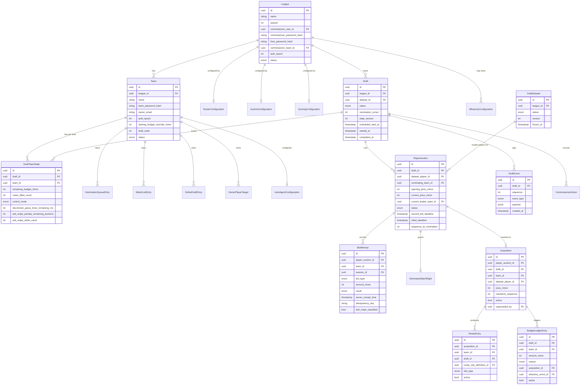

# Data Model

> **Note:** Pre-implementation. All entities are `[PLANNED]`. Derived from `data-model.md`.

## Overview

State-stored (not event-sourced) Postgres schema. Live rows (`DraftTeamState`, `PlayerAuction`, `Acquisition`, `RosterEntry`, ledger) are authoritative truth. `DraftEvent` is append-only audit log and WS reconnect replay source — not used for arbitrary state reconstruction. Money is integer minor units (cents). Rollback appends compensating rows; history is never mutated.

## Entity Relationship Diagram

## Key Entities

| Entity | Purpose | Key Fields | Relationships |
|--------|---------|------------|---------------|
| League | League configuration and auth | commissioner_password_hash, auth_epoch | 1:N Teams, 1:N Drafts [PLANNED] |
| Team | Team identity and budget override | team_password_hash, auth_epoch, starting_budget_override_minor | N:1 League, 1:N DraftTeamState [PLANNED] |
| Draft | Live draft event FSM | status, nomination_cursor, state_version | 1:1 DraftDataset, 1:N PlayerAuction [PLANNED] |
| DraftTeamState | Per-team live state | remaining_budget_minor, control_mode, anti_snipe_penalty_remaining_auctions | N:1 Draft, N:1 Team [PLANNED] |
| PlayerAuction | Single-player auction FSM | status, current_price_minor, current_leader_team_id, deadlines | N:1 Draft, 1:N BidAttempt [PLANNED] |
| BidAttempt | All bid attempts incl. rejected | bid_type, result, server_receipt_time, idempotency_key | N:1 PlayerAuction [PLANNED] |
| Acquisition | Awarded pick (append-only, supersede to correct) | price_minor, resolution_sequence, active | 1:N RosterEntry, 1:N BudgetLedgerEntry [PLANNED] |
| RosterEntry | Starter-first slot assignment | slot_type, active | N:1 Acquisition [PLANNED] |
| BudgetLedgerEntry | Ledger-backed budget changes | amount_minor, reason, active | N:1 Team, N:1 Draft [PLANNED] |
| DraftEvent | Immutable audit log + WS replay | sequence, event_type, payload | N:1 Draft [PLANNED] |
| DraftDataset | Frozen versioned player snapshot | status (FROZEN), version | Referenced by Draft [PLANNED] |

## Data Stores

| Store | Type | Purpose |
|-------|------|---------|
| PostgreSQL | Relational RDBMS | All persistent state — teams, draft, auctions, ledger, events [PLANNED] |
| In-memory (Node.js Map) | Process memory | Hot draft state per draft_id; authoritative only after DB commit [PLANNED] |
