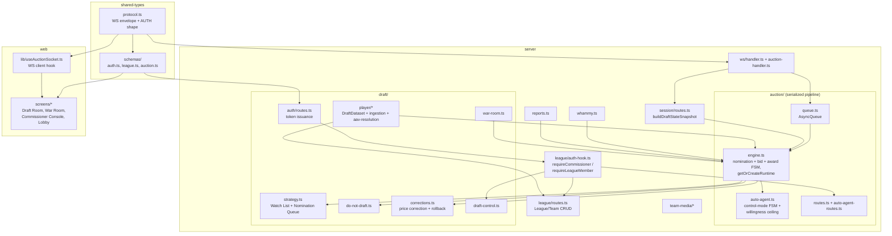

# Module Dependencies

## Overview

Three-package monorepo with a strict layering rule: `web` and `server` both consume `shared-types`; `web` never imports `server`. Within `server`, `auction/queue.ts`'s `AsyncQueue` is the serialization boundary — `auction/engine.ts` (the core FSM) and everything downstream of it (auto-agent, corrections, whammy, reports) route through it, keyed by `draft_id`. Module names below reflect the actual implemented layout, not the original design-doc sketch (there is no separate `draft/nomination/` or `draft/bid-pipeline/` directory — those concerns live inside `auction/engine.ts`).

## Dependency Graph

## Coupling Analysis

| Module | Fan-In | Fan-Out | Assessment |
|--------|--------|---------|------------|
| `shared-types/protocol.ts` | High (server/ws, web/lib) | Low | Stable contract — a breaking change requires coordinated update across every consumer |
| `server/auction/engine.ts` | High (ws/auction-handler, auto-agent, corrections, whammy, reports, war-room, session) | High (queue, DB schema, strategy, do-not-draft) | Hottest module (~1290 lines) — every bid/nominate/award/rollback path runs through it |
| `server/auction/queue.ts` | Medium (ws/auction-handler) | Low | The serialization boundary — breaking it allows concurrent mutations to race; never bypass, even from a timer callback |
| `server/league/auth-hook.ts` | High (nearly every authenticated route module) | Low | Every command touches it; correctness bugs here are league-wide |
| `server/ws/auction-handler.ts` | Low (entry point) | High (queue, session) | Top-level orchestrator — owns `server_receipt_time` stamping and the commissioner on-behalf-of override |
| `web/lib/useAuctionSocket.ts` | Low | Medium (all screens) | Client's single WS state source — all screens read from it |

## Circular Dependencies

None detected. The strict layering (`shared-types` → `server`/`web`, `web` never imports `server`) prevents cycles. Within `server/auction/`, `queue.ts` is the acyclic root — `engine.ts` and downstream `draft/*` modules do not back-import the queue directly (they call into `engine.ts`, which owns the queue interaction).
