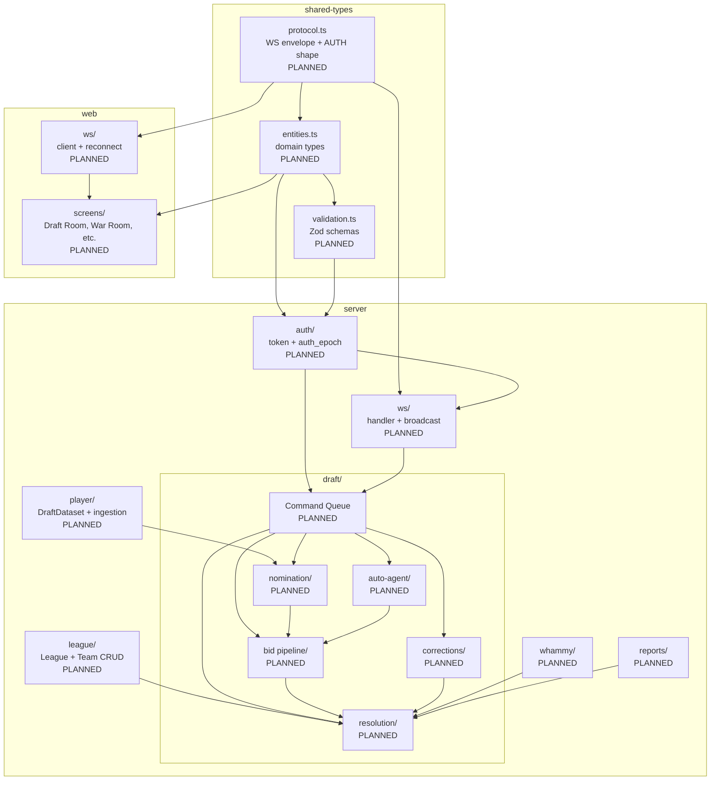

# Module Dependencies

> **Note:** Pre-implementation. All modules are `[PLANNED]`.

## Overview

Three-package monorepo with a strict layering rule: `web` and `server` both consume `shared-types`; `web` never imports `server`. Within `server`, the draft command pipeline is the most coupled core — nomination, bid, resolution, auto-agent, and rollback all route through the per-draft serialized command queue.

## Dependency Graph

## Coupling Analysis

| Module | Fan-In | Fan-Out | Assessment |
|--------|--------|---------|------------|
| `shared-types/protocol.ts` | High (server/ws + web/ws) | Low | Stable contract — change carefully, all WS code depends on it [PLANNED] |
| `server/draft/resolution` | High (bid, nomination, corrections, whammy, reports) | High (league, player, DB) | Hottest module — owns the Acquisition/Ledger/Roster transaction [PLANNED] |
| `server/draft/command-queue` | Medium (WS handler) | High (all draft sub-modules) | Serialization boundary — all mutations flow through here [PLANNED] |
| `server/auth` | Medium (WS, REST, all draft commands) | Low | Every command touches it; keep it thin and fast [PLANNED] |
| `server/ws` | Low (entry point) | High (auth, draft queue) | Top-level orchestrator, thin by design [PLANNED] |
| `web/ws` | Low | Medium (all screens) | Client's single state source — all screens read from it [PLANNED] |

## Circular Dependencies

None planned. The strict layering (shared-types → server/web, web never imports server) prevents cycles. Within `server/draft/`, the queue is the acyclic root — sub-modules do not back-import the queue.
