# Fantasy Football Auction Draft Platform — Domain / Data Model

**Purpose:** Agent-consumable domain specification.  
**Companion:** `prd.md`  
**Notation:** PK = primary key, FK = foreign key. Derived/materialized fields are explicitly identified.

---

## 1. Modeling Principles

1. **Draft** means the complete live drafting event.
2. **PlayerAuction** means one nominated player's auction.
3. All accepted state changes are server-authoritative.
4. `BidAttempt` includes accepted and rejected attempts.
5. Budget money is ledger-backed.
6. Rollback never deletes history.
7. Player data is versioned through `DraftDataset`.
8. Private owner strategy data is separated from shared player/reference data.
9. Roster assignments represent starter-slot fulfillment during the draft, not weekly lineup optimization.
10. Team control state (Manual/Auto-Agent) is part of live draft state.
11. Multi-window sessions belong to one team identity.
12. Rollback undoes the most recently resolved PlayerAuctions in strict reverse order; there is no arbitrary-point timeline branching. A single already-awarded pick may be corrected in place only when nothing depends on it yet (§17.5).
13. MVP authentication is password-based (site/league/team), not account-based; `User`/`Membership` model a future email-based identity layer.
14. Server state is isolated per `draft_id`; a deployment may host multiple concurrently RUNNING drafts across different leagues.

---

## 2. Bounded Contexts

```text
LEAGUE & RULES
  League
  Team
  Membership
  TeamMedia
  RosterConfiguration
  RosterSlotDefinition
  ScoringConfiguration
  ScoringRule
  AuctionConfiguration
  AutoAgentLeagueDefaults
  WhammyConfiguration
  WhammyDefinition

PLAYER INTELLIGENCE
  Player
  PlayerPositionEligibility
  ProviderPlayerMapping
  DraftDataset
  DataSource
  DatasetImport
  PlayerSeasonStats
  PlayerProjection
  PlayerStatus
  PlayerTier
  AAVSource
  PlayerAAV

OWNER PRIVATE STRATEGY
  OwnerPlayerTarget
  WatchListEntry
  NominationQueueEntry
  DoNotDraftEntry
  AutoAgentConfiguration

LIVE DRAFT
  Draft
  DraftTeamState
  DraftClientSession
  PlayerAuction
  BidAttempt
  NominatorMatchRight
  Acquisition
  RosterEntry
  BudgetLedgerEntry
  DraftEvent
  TeamDraftMediaState

RECOVERY / CONTROL
  CommissionerAction
  DraftTimeline

WHAMMY EXECUTION
  WhammyEvent

POST-DRAFT / TRANSFER
  DraftTeamEvaluation
  ProviderTeamMapping
  ExportJob
  ReconciliationItem
  DraftSummaryReport
  ReportDeliveryAttempt
```

---

## 3. Core Entities

### 3.1 League

```yaml
League:
  id: uuid PK
  name: string
  season: int
  commissioner_user_id: uuid FK(User)
  commissioner_password_hash: string
  logo_asset_uri: string nullable
  roster_configuration_id: uuid FK(RosterConfiguration)
  scoring_configuration_id: uuid FK(ScoringConfiguration)
  auction_configuration_id: uuid FK(AuctionConfiguration)
  status: enum[DRAFT, ACTIVE, ARCHIVED]
  created_at: timestamp
```

### 3.2 User

```yaml
User:
  id: uuid PK
  email: string nullable unique
  display_name: string
  created_at: timestamp
```

**MVP note:** password-based login (§3.6) does not require `email`; a `User` row may be created lazily on first authenticated session. `email` becomes required once magic-link authentication (future) is enabled.

### 3.3 Team

```yaml
Team:
  id: uuid PK
  league_id: uuid FK(League)
  name: string
  team_password_hash: string
  starting_budget_override_minor: int nullable
  draft_order: int
  status: enum[ACTIVE, INACTIVE]
  created_at: timestamp
```

**Invariant:** Effective starting budget = team override if present, otherwise AuctionConfiguration default.

### 3.4 Membership

```yaml
Membership:
  id: uuid PK
  league_id: uuid FK(League)
  team_id: uuid FK(Team) nullable
  user_id: uuid FK(User)
  role: enum[COMMISSIONER, HOST, OWNER]
  active: bool
```

Multiple authenticated users per team may be supported by schema even if initial UX assumes one primary owner.

### 3.5 TeamMedia

```yaml
TeamMedia:
  team_id: uuid PK/FK(Team)
  icon_asset_uri: string nullable
  nomination_audio_asset_uri: string nullable
  nomination_audio_duration_ms: int nullable
  updated_by_user_id: uuid FK(User)
  updated_at: timestamp
```

**Constraints:**
- audio must be MP3 or explicitly supported audio MIME;
- playback is capped at 5000 ms;
- media is presentation-only.

### 3.6 Authentication (MVP)

Not a domain entity: the site-wide password is deployment/server configuration (a single hashed secret), not a database row.

Login sequence: site password → select League → (Commissioner: enter `commissioner_password_hash` match) or (Owner: select Team → enter `team_password_hash` match). A successful login issues a signed session token carrying `{role, league_id, team_id?}`, used for API and WebSocket authentication. No separate session table is required for MVP; `DraftClientSession` (§11.3) tracks live draft connections specifically, not general auth state.

---

## 4. Roster Rules

### 4.1 RosterConfiguration

```yaml
RosterConfiguration:
  id: uuid PK
  league_id: uuid FK(League)
  total_roster_size: int
  total_starter_slots: int
  bench_slots: int
  require_full_roster: bool
```

**Invariant:**
`total_roster_size == total_starter_slots + bench_slots` unless future reserve/IR slot types are added explicitly.

### 4.2 RosterSlotDefinition

One row per slot type, not per physical ordinal.

```yaml
RosterSlotDefinition:
  id: uuid PK
  roster_configuration_id: uuid FK(RosterConfiguration)
  slot_code: string
  display_name: string
  count: int
  is_starter: bool
  assignment_priority: int
  eligibility_rule_json: json
  required: bool
  sort_order: int
```

Example:

```yaml
- slot_code: WR
  count: 2
  is_starter: true
  assignment_priority: 10
  eligibility: [WR]

- slot_code: OFF_FLEX
  count: 1
  is_starter: true
  assignment_priority: 20
  eligibility: [QB, RB, WR, TE]

- slot_code: BENCH
  count: 8
  is_starter: false
  assignment_priority: 100
  eligibility: [ANY_ROSTER_ELIGIBLE]
```

### 4.3 Starter-first assignment rule

For a newly acquired player:

```text
eligible_unfilled_starter_slots =
  all unfilled starter slots accepting player's eligibility

if any:
  choose lowest assignment_priority
  then lowest ordinal
else:
  assign first available bench ordinal
```

**Important:** Do not reshuffle prior assignments to maximize projected points.

---

## 5. Scoring Rules

### 5.1 ScoringConfiguration

```yaml
ScoringConfiguration:
  id: uuid PK
  league_id: uuid FK(League)
  name: string
  scoring_family: string  # e.g. STANDARD_NON_PPR
```

### 5.2 ScoringRule

```yaml
ScoringRule:
  id: uuid PK
  scoring_configuration_id: uuid FK(ScoringConfiguration)
  stat_code: string
  points_per_unit: decimal
  threshold_json: json nullable
```

---

## 6. Auction Configuration

### 6.1 AuctionConfiguration

```yaml
AuctionConfiguration:
  id: uuid PK
  league_id: uuid FK(League)

  default_starting_budget_minor: int
  minimum_acquisition_price_minor: int

  nomination_timer_ms: int
  second_bid_timer_ms: int
  rebid_timer_ms: int

  anti_snipe_enabled: bool
  anti_snipe_mode: enum[INFO, WARN, ENFORCE] nullable
  anti_snipe_threshold_ms: int nullable
  anti_snipe_count_threshold: int nullable
  anti_snipe_penalty_min_remaining_ms: int nullable
  anti_snipe_penalty_auctions: int nullable

  nominator_match_enabled: bool

  owners_can_rename_team: bool
  disconnect_auto_agent_delay_ms: int

  primary_aav_source_id: uuid FK(AAVSource) nullable
  secondary_aav_source_id: uuid FK(AAVSource) nullable
```

### 6.2 AutoAgentLeagueDefaults

```yaml
AutoAgentLeagueDefaults:
  auction_configuration_id: uuid PK/FK(AuctionConfiguration)
  random_variance_pct: decimal
  max_over_base_pct_default: decimal
  bench_value_pct_default: decimal
  prioritize_starters_default: bool
```

---

## 7. Player Master and Data Sources

### 7.1 Player

```yaml
Player:
  id: uuid PK
  canonical_key: string unique
  first_name: string
  last_name: string
  display_name: string
  nfl_team: string nullable
  bye_week: int nullable
  active_status: string
```

### 7.2 PlayerPositionEligibility

```yaml
PlayerPositionEligibility:
  player_id: uuid FK(Player)
  season: int
  position_code: string
  PK: [player_id, season, position_code]
```

### 7.3 ProviderPlayerMapping

```yaml
ProviderPlayerMapping:
  player_id: uuid FK(Player)
  provider_code: string
  season: int
  external_player_id: string nullable
  external_name: string
  confidence: decimal
  verified: bool
  PK: [player_id, provider_code, season]
```

### 7.4 DataSource

```yaml
DataSource:
  id: uuid PK
  code: string unique
  name: string
  source_type: enum[API, CSV, PDF, MANUAL]
```

### 7.5 DraftDataset

```yaml
DraftDataset:
  id: uuid PK
  league_id: uuid FK(League)
  season: int
  version: string
  status: enum[DRAFT, VALIDATED, FROZEN]
  frozen_at: timestamp nullable
  created_at: timestamp
```

### 7.6 DatasetImport

```yaml
DatasetImport:
  id: uuid PK
  draft_dataset_id: uuid FK(DraftDataset)
  data_source_id: uuid FK(DataSource)
  import_type: enum[PLAYER_MASTER, HISTORICAL_STATS, PROJECTIONS, STATUS, TIER, AAV]
  source_date: date nullable
  imported_at: timestamp
  source_artifact_uri: string nullable
  exact_matches: int
  probable_matches: int
  ambiguous_matches: int
  unmatched_rows: int
  status: enum[LOADED, NEEDS_REVIEW, VALIDATED, FAILED]
```

---

## 8. Player Facts / Intelligence

### 8.1 PlayerSeasonStats

```yaml
PlayerSeasonStats:
  draft_dataset_id: uuid FK(DraftDataset)
  player_id: uuid FK(Player)
  data_source_id: uuid FK(DataSource)
  stats_json: json
  calculated_fantasy_points: decimal nullable
  PK: [draft_dataset_id, player_id, data_source_id]
```

### 8.2 PlayerProjection

```yaml
PlayerProjection:
  draft_dataset_id: uuid FK(DraftDataset)
  player_id: uuid FK(Player)
  data_source_id: uuid FK(DataSource)
  projected_stats_json: json
  projected_fantasy_points: decimal
  source_updated_at: timestamp nullable
  imported_at: timestamp
  PK: [draft_dataset_id, player_id, data_source_id]
```

### 8.3 PlayerStatus

```yaml
PlayerStatus:
  id: uuid PK
  draft_dataset_id: uuid FK(DraftDataset)
  player_id: uuid FK(Player)
  data_source_id: uuid FK(DataSource)
  nfl_status: string nullable
  injury_status: string nullable
  injury_description: string nullable
  practice_status: string nullable
  depth_chart_status: string nullable
  source_updated_at: timestamp nullable
  imported_at: timestamp
```

### 8.4 PlayerTier

```yaml
PlayerTier:
  draft_dataset_id: uuid FK(DraftDataset)
  player_id: uuid FK(Player)
  data_source_id: uuid FK(DataSource)
  position_context: string
  tier_number: int
  PK: [draft_dataset_id, player_id, data_source_id, position_context]
```

---

## 9. AAV

### 9.1 AAVSource

```yaml
AAVSource:
  id: uuid PK
  draft_dataset_id: uuid FK(DraftDataset)
  data_source_id: uuid FK(DataSource)
  display_name: string
  scoring_format: string nullable
  team_count: int nullable
  roster_description: string nullable
  budget_basis_minor: int nullable
  source_date: date nullable
  source_artifact_uri: string nullable
```

### 9.2 PlayerAAV

```yaml
PlayerAAV:
  aav_source_id: uuid FK(AAVSource)
  player_id: uuid FK(Player)
  value_minor: int
  PK: [aav_source_id, player_id]
```

**Invariant:** AAV values are static within a frozen DraftDataset.

---

## 10. Owner Private Strategy

### 10.1 OwnerPlayerTarget

```yaml
OwnerPlayerTarget:
  draft_id: uuid FK(Draft)
  team_id: uuid FK(Team)
  player_id: uuid FK(Player)
  target_value_minor: int
  is_customized: bool
  updated_at: timestamp
  PK: [draft_id, team_id, player_id]
```

### 10.2 WatchListEntry

```yaml
WatchListEntry:
  id: uuid PK
  draft_id: uuid FK(Draft)
  team_id: uuid FK(Team)
  player_id: uuid FK(Player)
  sort_order: int nullable
  note: string nullable
```

**Invariant:** Watch List never auto-nominates.

### 10.3 NominationQueueEntry

```yaml
NominationQueueEntry:
  id: uuid PK
  draft_id: uuid FK(Draft)
  team_id: uuid FK(Team)
  player_id: uuid FK(Player)
  sort_order: int
  opening_bid_minor: int nullable
```

### 10.4 DoNotDraftEntry

```yaml
DoNotDraftEntry:
  draft_id: uuid FK(Draft)
  team_id: uuid FK(Team)
  player_id: uuid FK(Player)
  PK: [draft_id, team_id, player_id]
```

### 10.5 AutoAgentConfiguration

```yaml
AutoAgentConfiguration:
  draft_id: uuid FK(Draft)
  team_id: uuid FK(Team)

  use_owner_target_when_customized: bool
  fallback_to_primary_aav: bool

  max_over_base_pct: decimal
  random_variance_pct: decimal
  bench_value_pct: decimal
  prioritize_starters: bool

  updated_at: timestamp

  PK: [draft_id, team_id]
```

**Design intent:** simple, explainable automation. Not an optimizer.

---

## 11. Live Draft

### 11.1 Draft

```yaml
Draft:
  id: uuid PK
  league_id: uuid FK(League)
  draft_dataset_id: uuid FK(DraftDataset)
  scheduled_start_at: timestamp nullable
  status: enum[UPCOMING, RUNNING, PAUSED, COMPLETE]
  current_nomination_team_id: uuid FK(Team) nullable
  current_player_auction_id: uuid FK(PlayerAuction) nullable
  active_timeline_id: uuid FK(DraftTimeline)
  state_version: bigint
  started_at: timestamp nullable
  completed_at: timestamp nullable
```

### 11.2 DraftTeamState

Materialized/live state. Ledger/events remain durable authorities.

```yaml
DraftTeamState:
  draft_id: uuid FK(Draft)
  team_id: uuid FK(Team)

  control_mode: enum[MANUAL, AUTO_AGENT]
  control_mode_reason: enum[USER_ENABLED, COMMISSIONER_ENABLED, DISCONNECTED] nullable
  control_mode_changed_at: timestamp

  connection_state: enum[CONNECTED, RECONNECTING, DISCONNECTED]
  connected_session_count: int
  reconnect_deadline_at: timestamp nullable

  starting_budget_minor: int
  remaining_budget_minor: int

  roster_count: int
  remaining_roster_slots: int
  starter_slots_filled: int
  starter_slots_remaining: int
  max_legal_bid_minor: int

  nomination_eligible: bool
  roster_complete: bool

  state_version: bigint

  PK: [draft_id, team_id]
```

### 11.3 DraftClientSession

```yaml
DraftClientSession:
  id: uuid PK
  draft_id: uuid FK(Draft)
  user_id: uuid FK(User)
  team_id: uuid FK(Team) nullable
  view_role: enum[DRAFT_VIEW, WAR_ROOM, COMMISSIONER, HOST]
  connected: bool
  connected_at: timestamp
  last_seen_at: timestamp
  disconnected_at: timestamp nullable
  measured_latency_ms: int nullable
```

**Disconnect invariant:** team is considered disconnected only when no valid owner/team session remains connected.

### 11.4 TeamDraftMediaState

```yaml
TeamDraftMediaState:
  draft_id: uuid FK(Draft)
  team_id: uuid FK(Team)
  first_nomination_audio_played_at: timestamp nullable
  PK: [draft_id, team_id]
```

---

## 12. PlayerAuction

```yaml
PlayerAuction:
  id: uuid PK
  draft_id: uuid FK(Draft)
  player_id: uuid FK(Player)
  nominating_team_id: uuid FK(Team)
  opening_bid_minor: int

  state: enum[
    NOMINATION_ACCEPTED,
    SECOND_BID_OPEN,
    REBID_OPEN,
    PAUSED,
    RESOLVING,
    AWARDED,
    REVERSED
  ]

  high_bid_team_id: uuid FK(Team) nullable
  high_bid_minor: int
  accepted_bid_sequence: bigint

  opened_at: timestamp
  deadline_at: timestamp
  paused_remaining_ms: int nullable
  resolved_at: timestamp nullable

  auction_version: bigint
  timeline_id: uuid FK(DraftTimeline)
```

**Important invariant:** normally an accepted bid increases amount. A legal `MATCH` may change `high_bid_team_id` while keeping `high_bid_minor` unchanged.

---

## 13. Nominator Match

```yaml
NominatorMatchRight:
  player_auction_id: uuid PK/FK(PlayerAuction)
  nominating_team_id: uuid FK(Team)
  available: bool
  consumed_at: timestamp nullable
  consumed_by_bid_attempt_id: uuid FK(BidAttempt) nullable
```

Match is available only while bidding is open and is consumed at most once.

---

## 14. BidAttempt

```yaml
BidAttempt:
  id: uuid PK
  player_auction_id: uuid FK(PlayerAuction)
  team_id: uuid FK(Team)

  bid_type: enum[
    PLUS_ONE,
    CUSTOM,
    MATCH,
    AUTO_AGENT,
    COMMISSIONER_FOR_OWNER
  ]

  requested_amount_minor: int
  previous_bid_minor: int

  client_displayed_bid_minor: int nullable
  client_auction_version: bigint nullable
  server_auction_version_before: bigint
  server_auction_version_after: bigint nullable

  client_clicked_at: timestamp nullable
  server_received_at: timestamp
  server_processed_at: timestamp

  time_remaining_at_receipt_ms: int
  measured_latency_ms: int nullable

  accepted: bool
  rejection_reason: string nullable

  became_high_bidder: bool
  triggered_timer_reset: bool
  sniping_event: bool

  session_id: uuid FK(DraftClientSession) nullable
  idempotency_key: string
  accepted_sequence: bigint nullable
```

**Unique:** `(player_auction_id, team_id, idempotency_key)` or equivalent command identity.

---

## 15. Acquisition and Roster

### 15.1 Acquisition

```yaml
Acquisition:
  id: uuid PK
  draft_id: uuid FK(Draft)
  player_auction_id: uuid FK(PlayerAuction)
  player_id: uuid FK(Player)
  team_id: uuid FK(Team)
  purchase_price_minor: int
  acquired_at: timestamp
  timeline_id: uuid FK(DraftTimeline)
  active: bool
```

**Invariant:** one active acquisition per `(draft_id, player_id)`.

### 15.2 RosterEntry

One row per acquired player.

```yaml
RosterEntry:
  id: uuid PK
  draft_id: uuid FK(Draft)
  team_id: uuid FK(Team)
  player_id: uuid FK(Player)
  acquisition_id: uuid FK(Acquisition)

  roster_slot_definition_id: uuid FK(RosterSlotDefinition)
  slot_ordinal: int
  is_starter_assignment: bool

  active: bool
  assigned_at: timestamp
  timeline_id: uuid FK(DraftTimeline)
```

**Assignment invariant:** use starter-first deterministic algorithm; do not optimize prior roster assignments.

---

## 16. Budget Ledger

```yaml
BudgetLedgerEntry:
  id: uuid PK
  draft_id: uuid FK(Draft)
  team_id: uuid FK(Team)
  delta_minor: int
  reason_type: enum[
    STARTING_BUDGET,
    ACQUISITION,
    ACQUISITION_REVERSAL,
    COMMISSIONER_ADJUSTMENT,
    CORRECTION,
    CORRECTION_REVERSAL,
    WHAMMY,
    ROLLBACK_COMPENSATION
  ]
  reference_id: uuid nullable
  event_sequence: bigint
  timeline_id: uuid FK(DraftTimeline)
  created_at: timestamp
```

Remaining budget must reconcile to sum of active-timeline ledger entries.

---

## 17. Event / Recovery Model

### 17.1 DraftEvent

```yaml
DraftEvent:
  draft_id: uuid FK(Draft)
  sequence: bigint
  timeline_id: uuid FK(DraftTimeline)
  event_type: string
  actor_user_id: uuid FK(User) nullable
  actor_team_id: uuid FK(Team) nullable
  payload_json: json
  created_at: timestamp
  PK: [draft_id, sequence]
```

### 17.2 DraftTimeline

```yaml
DraftTimeline:
  id: uuid PK
  draft_id: uuid FK(Draft)
  created_at: timestamp
```

**MVP note:** exactly one `DraftTimeline` exists per `Draft`, created when the draft starts. Rollback and correction append events and compensating ledger/roster/acquisition rows to this same timeline; they never branch. There is no `DraftCheckpoint` entity — see §17.5.

### 17.4 CommissionerAction

```yaml
CommissionerAction:
  id: uuid PK
  draft_id: uuid FK(Draft)
  actor_user_id: uuid FK(User)
  action_type: string
  reason: string
  before_state_json: json nullable
  after_state_json: json nullable
  event_sequence: bigint
  created_at: timestamp
```

### 17.5 Rollback and Correction Model

MVP uses a single append-only `DraftTimeline` per `Draft`. There is no branching and no arbitrary-point state reconstruction.

**Single-pick correction (no conflict).** Applies when the winning team of the target `Acquisition` has made no other active `Acquisition` with a later resolution sequence. The correction reverses that one acquisition's `BudgetLedgerEntry` (reason `CORRECTION_REVERSAL`) and `RosterEntry`, then applies the corrected values (reason `CORRECTION`). No other team's state changes.

**Rollback (conflict, or N picks).** Applies otherwise, or when more than one pick must be undone. Undo proceeds strictly in reverse resolution order: for each `Acquisition` being undone, mark it `active = false`, append a `BudgetLedgerEntry` (reason `ROLLBACK_COMPENSATION`), deactivate its `RosterEntry`, restore `NominatorMatchRight` state for that `PlayerAuction`, and — once the last (earliest) undone pick is reached — move the `Draft`'s nomination cursor back to that team's turn. The player returns to available.

Undo points are implicit: every `AWARDED` `PlayerAuction`, ordered by resolution time, is itself an undo boundary. No separate checkpoint entity is required.

---

## 18. Whammy

### 18.1 WhammyConfiguration

```yaml
WhammyConfiguration:
  id: uuid PK
  league_id: uuid FK(League)
  enabled: bool
  allow_positive: bool
  allow_negative: bool
  max_per_team: int nullable
  max_per_draft: int nullable
  commissioner_approval_required: bool
```

### 18.2 WhammyDefinition

```yaml
WhammyDefinition:
  id: uuid PK
  whammy_configuration_id: uuid FK(WhammyConfiguration)
  name: string
  type: enum[POSITIVE, NEGATIVE]
  budget_delta_minor: int nullable
  display_message: string
  offline_action_text: string nullable
  weight: decimal
  active: bool
```

### 18.3 WhammyEvent

```yaml
WhammyEvent:
  id: uuid PK
  draft_id: uuid FK(Draft)
  team_id: uuid FK(Team) nullable
  definition_id: uuid FK(WhammyDefinition)
  trigger_event_sequence: bigint
  budget_ledger_entry_id: uuid FK(BudgetLedgerEntry) nullable
  status: enum[PENDING_APPROVAL, APPLIED, REJECTED, REVERSED]
  timeline_id: uuid FK(DraftTimeline)
  created_at: timestamp
```

---

## 19. Post-Draft / ESPN

### 19.1 DraftTeamEvaluation

```yaml
DraftTeamEvaluation:
  draft_id: uuid FK(Draft)
  team_id: uuid FK(Team)
  projected_drafted_starter_points: decimal
  roster_depth_metric: decimal nullable
  aav_efficiency: decimal nullable
  calculation_version: string
  PK: [draft_id, team_id]
```

### 19.2 ProviderTeamMapping

```yaml
ProviderTeamMapping:
  league_id: uuid FK(League)
  provider_code: string
  team_id: uuid FK(Team)
  external_team_id: string nullable
  external_team_name: string
  verified: bool
  PK: [league_id, provider_code, team_id]
```

### 19.3 ExportJob

```yaml
ExportJob:
  id: uuid PK
  draft_id: uuid FK(Draft)
  provider_code: string
  schema_version: string
  status: enum[PENDING, VALIDATED, GENERATED, FAILED]
  artifact_uri: string nullable
  artifact_checksum: string nullable
  validation_json: json
  created_at: timestamp
```

### 19.4 ReconciliationItem

```yaml
ReconciliationItem:
  id: uuid PK
  export_job_id: uuid FK(ExportJob)
  team_id: uuid FK(Team)
  player_id: uuid FK(Player)
  recommended_target_slot: string nullable
  status: enum[PENDING, CONFIRMED, AMBIGUOUS, FAILED]
  confirmed_by_user_id: uuid FK(User) nullable
  confirmed_at: timestamp nullable
```

### 19.5 DraftSummaryReport

```yaml
DraftSummaryReport:
  id: uuid PK
  draft_id: uuid FK(Draft)
  generated_at: timestamp
  league_summary_json: json
  team_report_json: json
```

### 19.6 ReportDeliveryAttempt

```yaml
ReportDeliveryAttempt:
  id: uuid PK
  draft_summary_report_id: uuid FK(DraftSummaryReport)
  team_id: uuid FK(Team) nullable
  recipient_email: string
  status: enum[PENDING, SENT, FAILED, SKIPPED_EMAIL_DISABLED]
  sent_at: timestamp nullable
  error_detail: string nullable
```

`team_id` null identifies the commissioner/league-wide copy.

---

## 20. Mermaid ERD

```mermaid
erDiagram
    USER ||--o{ MEMBERSHIP : has
    LEAGUE ||--o{ MEMBERSHIP : contains
    LEAGUE ||--o{ TEAM : contains
    TEAM ||--o{ MEMBERSHIP : represented_by
    TEAM ||--o| TEAM_MEDIA : presents_as

    LEAGUE ||--|| ROSTER_CONFIGURATION : uses
    ROSTER_CONFIGURATION ||--o{ ROSTER_SLOT_DEFINITION : defines
    LEAGUE ||--|| SCORING_CONFIGURATION : uses
    SCORING_CONFIGURATION ||--o{ SCORING_RULE : contains
    LEAGUE ||--|| AUCTION_CONFIGURATION : uses
    AUCTION_CONFIGURATION ||--o| AUTO_AGENT_LEAGUE_DEFAULTS : defaults

    LEAGUE ||--o{ DRAFT_DATASET : has
    DRAFT_DATASET ||--o{ DATASET_IMPORT : records
    DATA_SOURCE ||--o{ DATASET_IMPORT : supplies

    PLAYER ||--o{ PLAYER_POSITION_ELIGIBILITY : eligible_as
    PLAYER ||--o{ PROVIDER_PLAYER_MAPPING : maps_to
    DRAFT_DATASET ||--o{ PLAYER_SEASON_STATS : contains
    DRAFT_DATASET ||--o{ PLAYER_PROJECTION : contains
    DRAFT_DATASET ||--o{ PLAYER_STATUS : contains
    DRAFT_DATASET ||--o{ PLAYER_TIER : contains
    PLAYER ||--o{ PLAYER_SEASON_STATS : has
    PLAYER ||--o{ PLAYER_PROJECTION : has
    PLAYER ||--o{ PLAYER_STATUS : has
    PLAYER ||--o{ PLAYER_TIER : has

    DRAFT_DATASET ||--o{ AAV_SOURCE : contains
    AAV_SOURCE ||--o{ PLAYER_AAV : values
    PLAYER ||--o{ PLAYER_AAV : receives

    LEAGUE ||--o{ DRAFT : runs
    DRAFT_DATASET ||--o{ DRAFT : powers
    DRAFT ||--o{ DRAFT_TEAM_STATE : has
    TEAM ||--o{ DRAFT_TEAM_STATE : participates
    DRAFT ||--o{ DRAFT_CLIENT_SESSION : connects
    USER ||--o{ DRAFT_CLIENT_SESSION : opens
    TEAM ||--o{ DRAFT_CLIENT_SESSION : controls
    DRAFT ||--o{ TEAM_DRAFT_MEDIA_STATE : tracks
    TEAM ||--o{ TEAM_DRAFT_MEDIA_STATE : owns

    DRAFT ||--o{ OWNER_PLAYER_TARGET : stores
    TEAM ||--o{ OWNER_PLAYER_TARGET : owns
    PLAYER ||--o{ OWNER_PLAYER_TARGET : targets

    DRAFT ||--o{ WATCH_LIST_ENTRY : stores
    TEAM ||--o{ WATCH_LIST_ENTRY : owns
    PLAYER ||--o{ WATCH_LIST_ENTRY : watches

    DRAFT ||--o{ NOMINATION_QUEUE_ENTRY : stores
    TEAM ||--o{ NOMINATION_QUEUE_ENTRY : owns
    PLAYER ||--o{ NOMINATION_QUEUE_ENTRY : queues

    DRAFT ||--o{ DO_NOT_DRAFT_ENTRY : stores
    TEAM ||--o{ DO_NOT_DRAFT_ENTRY : owns
    PLAYER ||--o{ DO_NOT_DRAFT_ENTRY : excludes

    DRAFT ||--o{ AUTO_AGENT_CONFIGURATION : configures
    TEAM ||--o{ AUTO_AGENT_CONFIGURATION : owns

    DRAFT ||--o{ PLAYER_AUCTION : contains
    PLAYER ||--o{ PLAYER_AUCTION : auctioned_as
    TEAM ||--o{ PLAYER_AUCTION : nominates

    PLAYER_AUCTION ||--|| NOMINATOR_MATCH_RIGHT : grants
    PLAYER_AUCTION ||--o{ BID_ATTEMPT : receives
    TEAM ||--o{ BID_ATTEMPT : submits
    DRAFT_CLIENT_SESSION ||--o{ BID_ATTEMPT : originates

    PLAYER_AUCTION ||--o| ACQUISITION : resolves_to
    PLAYER ||--o{ ACQUISITION : acquired
    TEAM ||--o{ ACQUISITION : wins

    ACQUISITION ||--|| ROSTER_ENTRY : creates
    ROSTER_SLOT_DEFINITION ||--o{ ROSTER_ENTRY : assigned_to
    TEAM ||--o{ ROSTER_ENTRY : rosters

    DRAFT ||--o{ BUDGET_LEDGER_ENTRY : records
    TEAM ||--o{ BUDGET_LEDGER_ENTRY : has

    DRAFT ||--o{ DRAFT_EVENT : emits
    DRAFT ||--|| DRAFT_TIMELINE : has
    DRAFT_TIMELINE ||--o{ DRAFT_EVENT : contains
    DRAFT ||--o{ COMMISSIONER_ACTION : audits

    LEAGUE ||--o| WHAMMY_CONFIGURATION : configures
    WHAMMY_CONFIGURATION ||--o{ WHAMMY_DEFINITION : defines
    DRAFT ||--o{ WHAMMY_EVENT : triggers
    WHAMMY_DEFINITION ||--o{ WHAMMY_EVENT : instantiates

    DRAFT ||--o{ DRAFT_TEAM_EVALUATION : evaluates
    DRAFT ||--o{ EXPORT_JOB : exports
    EXPORT_JOB ||--o{ RECONCILIATION_ITEM : contains
    DRAFT ||--o| DRAFT_SUMMARY_REPORT : produces
    DRAFT_SUMMARY_REPORT ||--o{ REPORT_DELIVERY_ATTEMPT : deliveries
    TEAM ||--o{ REPORT_DELIVERY_ATTEMPT : receives
```



---

## 21. Critical Invariants for Agents / Developers

```yaml
invariants:
  - "Only one active PlayerAuction exists per Draft."
  - "Only one active Acquisition exists per Draft+Player."
  - "Bid acceptance is server-authoritative."
  - "Relative bids (+$1, Match) reject stale expected bid/version."
  - "Custom bids are exact absolute offers and never auto-increment beyond entered value."
  - "Match can be accepted at most once per PlayerAuction."
  - "Match is the only accepted event allowed to change high bidder without increasing high bid."
  - "PlayerAuction deadline is a server timestamp."
  - "Budget cannot fall below the amount required to fill required remaining roster spots unless commissioner override is explicitly supported."
  - "Roster assignment fills eligible starter slots before Bench."
  - "Roster assignment does not reshuffle prior players to optimize projections."
  - "Watch List never auto-nominates."
  - "Nomination Queue may auto-nominate."
  - "Owner strategy data is private to team and authorized commissioner operations."
  - "AAV is static inside a frozen DraftDataset."
  - "Disconnect Auto-Agent transition occurs only when zero valid team sessions remain connected through the grace deadline."
  - "Reconnection after Auto-Agent takeover does not automatically resume MANUAL."
  - "Auto-Agent mode changes are broadcast and auditable."
  - "Nomination audio plays at most once per Team+Draft and for no more than 5 seconds."
  - "Rollback and correction append compensating events and ledger/roster rows to the single active DraftTimeline; historical events are never deleted or mutated."
  - "Single-pick correction is permitted only when the winning team has no later active acquisition; otherwise rollback of the intervening picks is required."
  - "Rollback always undoes the most recently resolved PlayerAuctions first, in strict reverse order; it cannot skip to an arbitrary earlier pick without undoing everything after it."
  - "Each server process may host multiple concurrently RUNNING Drafts across different Leagues; all draft state, timers, and broadcasts are isolated per draft_id."
  - "Passwords (site, league, team) are stored hashed, never in plaintext."
  - "Displayed remaining budget reconciles to active ledger state."
```
