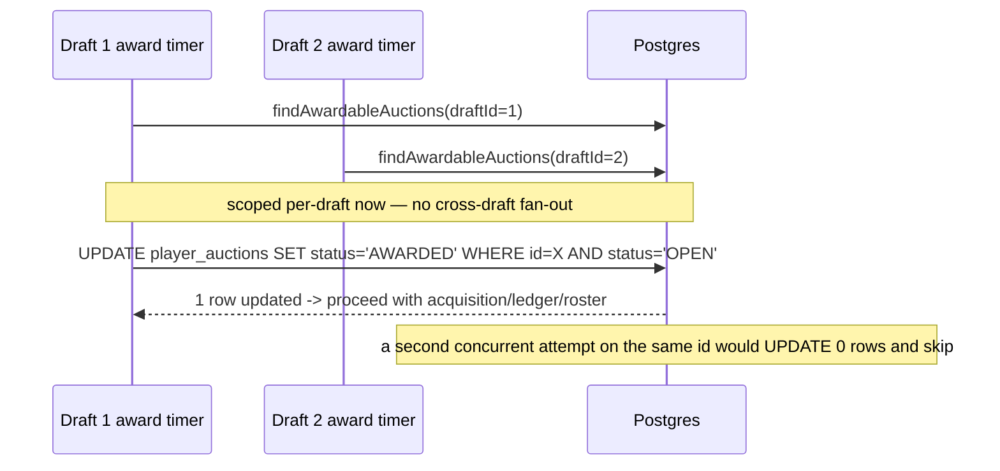

# fix: Auction integrity and session security P1 findings

## Summary

A full-repo code review surfaced four P1 findings. All four were verified against
the current `develop` branch code (not just the review text) — three are still
present exactly as described; one (owner session epoch checking) is **partially**
fixed already (two of three call sites are correct) but one call site still has
the bug. This plan fixes all four, in order of blast radius: auth correctness
first, then in-auction integrity, then deployability.

## Product Contract preservation

No upstream requirements document exists for this work — origin is the pasted
code-review findings plus this session's own code verification. No Product
Contract to preserve.

---

## Problem Frame

Four independent defects, three touching CLAUDE.md constraint #12 (auth epoch
is the only revocation mechanism and must be role-aware) and constraint #4/#11
(command atomicity and multi-draft isolation):

1. **F1 — Owner reconnect/lobby endpoints check the wrong auth epoch.**
   `verifyTokenAndEpoch` in `server/src/session/routes.ts` always re-reads
   `leagues.auth_epoch`, even for OWNER tokens, which are issued and revoked
   against `teams.auth_epoch`. This is the exact bug the review described —
   but only in this one file. `server/src/league/auth-hook.ts`
   (`verifyAndCheckEpoch`) and `server/src/auction/engine.ts`
   (`readAuthEpoch`), which the review's own recommended fix pattern is drawn
   from, are already role-aware and correct. `server/src/draft/war-room.ts`,
   `strategy.ts`, `espn-transfer.ts`, and `reports.ts` are also already
   correct. So this is a **one-file, two-call-site** fix, not a repo-wide one.

2. **F2 — Any owner can pass another team's nomination turn.**
   `processPassNomination` in `server/src/auction/engine.ts` receives the
   caller's `teamId` and explicitly discards it (`void teamId;`, with a
   comment acknowledging the gap) before advancing `nomination_cursor`. Fully
   confirmed as described.

3. **F3 — Award processing can double-resolve the same auction.**
   `processAwardCycle` (`server/src/auction/engine.ts`) runs on a 500ms
   `setInterval` started per-draft (`startAwardTimer`), but
   `findAwardableAuctions` queries expired `OPEN` auctions across **all**
   running drafts with no `draft_id` filter, and `awardAuction` runs the
   award transaction directly from the timer callback — outside the
   per-draft command queue that every other mutating command uses. The
   `UPDATE player_auctions SET status = 'AWARDED' ...` has no `WHERE
   status = 'OPEN'` guard, and there is no DB uniqueness constraint on
   `acquisitions.player_auction_id`. Fully confirmed as described, including
   the missing DB constraint.

4. **F4 — Production browser clients cannot reach the deployed API.**
   `server/src/main.ts`'s `fastifyCors` registration hardcodes
   `origin: ['http://localhost:5173', 'http://127.0.0.1:5173']` with no
   environment-variable override, and nothing in `server/` serves a built
   frontend. Fully confirmed as described.

## Scope Boundaries

**In scope:** the four findings above, fixed at their root cause, plus the
minimum test coverage to prove each fix and guard against regression.

**Out of scope:**
- Rewriting `verifyAndCheckEpoch` / `readAuthEpoch` / the other already-correct
  call sites — they are the *pattern* to copy, not something to touch.
- Any change to Railway deploy config or adding a frontend-hosting service —
  F4's fix is CORS configurability only; where the frontend actually gets
  hosted is a deployment decision, not a code-review fix.
- General auth/session hardening beyond these four items.

### Deferred to Follow-Up Work

- Migrating `processAwardCycle` fully onto the existing per-draft
  `AsyncQueue` abstraction used elsewhere (U3 below adds an equivalent
  atomic-claim guard without requiring that migration; a follow-up could
  unify the two paths if that abstraction gains support for
  timer-triggered, not just client-triggered, commands).

---

## Key Technical Decisions

**KTD1 — F1 fix mirrors `requireLeagueMember`'s existing role-aware pattern.**
Add the same `if (claims.role === 'OWNER' && claims.team_id) → teams.auth_epoch`
branch (else `leagues.auth_epoch`) already proven correct in
`server/src/league/auth-hook.ts` and `server/src/auction/engine.ts`. No new
pattern invented.

**KTD2 — F2 fix validates against the row, not the request, and updates
atomically.** Resolve the team at the current `nomination_cursor` from the DB
inside the same operation that advances the cursor, and reject if it doesn't
equal the caller's `teamId`. Doing the check and the cursor advance in one
`sql.begin` transaction (as `advanceNominationTurn` already does) closes the
TOCTOU gap a separate pre-check-then-update would leave open.

**KTD3 — F3 fix uses an atomic conditional claim, not a full queue migration
(*session-settled: user-directed — chosen over migrating the award path onto
the AsyncQueue: the review's own suggested fix is "queue it, or claim it
atomically," and an atomic conditional UPDATE closes the double-resolution
window with a much smaller diff than restructuring the award timer around
the client-command queue*).** Two complementary changes:
   - Scope `findAwardableAuctions` to the one `draftId` the timer belongs to
     (removes the "one query returns every draft's expired auctions" fan-out
     that lets two different drafts' timers race on the same row — though
     since all timers query all drafts today, this also removes the
     redundant work of N timers each re-scanning every draft).
   - Change the `UPDATE player_auctions SET status = 'AWARDED' ...` to
     `UPDATE ... WHERE id = ${auctionId} AND status = 'OPEN'` and check the
     returned row count; if zero rows updated, another resolution already
     claimed this auction — skip the rest of `awardAuction` for it. This is
     the atomic claim: Postgres row-level locking during the `UPDATE`
     serializes concurrent attempts, and the `status = 'OPEN'` predicate
     means only one can win.
   - Add a DB-level uniqueness constraint on
     `acquisitions.player_auction_id` as defense in depth, so even a future
     code path that skips the guard cannot insert two acquisitions for one
     player auction.

**KTD4 — F4 fix adds a configurable allowlist, not a wildcard.** Read
production frontend origin(s) from a required env var
(e.g. `FRONTEND_ORIGIN`, comma-separated for multiple), validated at boot the
same way other required env vars are (`server/src/config/env-check.cjs`), and
concatenate with the existing localhost origins only when `NODE_ENV !==
'production'`. Never falls back to `origin: true` / `*` — CORS with
`credentials: true` and a wildcard origin is both invalid per the Fetch spec
and a security regression.

---

## High-Level Technical Design

```mermaid
sequenceDiagram
    participant TeamA as Owner A (not current nominator)
    participant WS as ws/auction-handler.ts
    participant Engine as engine.ts processPassNomination
    participant DB as Postgres

    TeamA->>WS: PASS_NOMINATION
    WS->>Engine: processPassNomination(draftId, teamAId, leagueId)
    Engine->>DB: BEGIN; SELECT nomination_cursor, current nominator team
    DB-->>Engine: current nominator = Team B
    Engine->>Engine: teamAId !== Team B.id -> reject
    Engine-->>WS: no-op / error (cursor unchanged)
    WS-->>TeamA: PASS_NOMINATION rejected
```



---

## Implementation Units

### U1. Fix owner-session epoch check in session routes

**Goal:** `verifyTokenAndEpoch` in `server/src/session/routes.ts` checks
`teams.auth_epoch` for OWNER tokens and `leagues.auth_epoch` for
COMMISSIONER/HOST tokens, matching the pattern already used correctly
elsewhere in the codebase.

**Requirements:** F1.

**Dependencies:** none.

**Files:**
- `server/src/session/routes.ts` (modify `verifyTokenAndEpoch`)
- `server/src/__tests__/F-MOD-*` — add or extend a test file covering
  `GET /leagues/:leagueId/drafts` and `GET /drafts/:draftId/state` under an
  OWNER token (new or existing session/reconnect test file — check
  `server/src/__tests__/` for the current F-MOD id covering session routes
  before naming a new file)

**Approach:**
1. Port the same role branch used in `server/src/league/auth-hook.ts`'s
   `verifyAndCheckEpoch` (KTD1): if `claims.role === 'OWNER'` and
   `claims.team_id` is present, query `teams.auth_epoch` scoped to that
   team_id (and, for defense in depth, the token's `league_id`); otherwise
   query `leagues.auth_epoch` as today.
2. Preserve existing response codes/shapes (`404 NOT_FOUND`,
   `401 TOKEN_REVOKED`) for both branches.
3. Leave the two call sites (`GET /leagues/:leagueId/drafts`,
   `GET /drafts/:draftId/state`) and their downstream `league_id`/`draft_id`
   scope checks unchanged — only the epoch-source branch changes.

**Patterns to follow:** `server/src/league/auth-hook.ts`'s
`verifyAndCheckEpoch` (lines ~50-68 for the OWNER branch);
`server/src/auction/engine.ts`'s `readAuthEpoch`.

**Test scenarios:**
- An OWNER token whose `teams.auth_epoch` still matches the token's
  `auth_epoch`, but `leagues.auth_epoch` has since been bumped (commissioner
  password changed) — `GET /leagues/:leagueId/drafts` succeeds (this is the
  false-negative the review flagged: today it would incorrectly 401).
- An OWNER token whose `teams.auth_epoch` has been bumped (that team's
  password changed / explicit revoke) but `leagues.auth_epoch` is unchanged —
  `GET /drafts/:draftId/state` returns `401 TOKEN_REVOKED` (the
  false-positive-valid case the review flagged: today it would incorrectly
  succeed).
- A COMMISSIONER or HOST token still checks `leagues.auth_epoch` exactly as
  before (no regression for the non-OWNER path).
- An OWNER token with no `team_id` claim still gets a defined rejection
  rather than falling through to the league branch.

**Verification:** New/extended tests pass; `npm run typecheck` clean.

---

### U2. Enforce nominator identity in PASS_NOMINATION

**Goal:** `processPassNomination` rejects a pass attempt when the calling
team is not the team currently at `nomination_cursor`, and the check plus the
cursor advance happen atomically.

**Requirements:** F2.

**Dependencies:** none.

**Files:**
- `server/src/auction/engine.ts` (modify `processPassNomination`, and
  `advanceNominationTurn` if the current-nominator lookup is easiest to
  share there)
- `server/src/ws/auction-handler.ts` (only if the WS handler needs to
  surface a rejection message back to the caller — check how other rejected
  commands, e.g. bid rejection, report back to the sender)
- `server/src/__tests__/` — extend whichever F-MOD test file already covers
  nomination/pass flow (e.g. an F-MOD-002 or F-MOD-003 rework test) with the
  new rejection case

**Approach:**
1. Inside `processPassNomination`, resolve the team at the *current*
   `nomination_cursor` (same lookup `advanceNominationTurn`/
   `triggerCurrentNominationTurn` already perform) before mutating anything.
2. If that team's id !== the passed-in `teamId`, return without advancing
   the cursor. Per KTD2, do the lookup-and-compare inside the same
   `sql.begin` transaction that performs the cursor UPDATE, so a concurrent
   pass/award/nomination cannot slip in between the check and the advance.
3. Decide, consistent with how other rejected WS commands behave (check
   `processBidCommand`'s rejection path in `engine.ts` for the existing
   convention), whether to surface an explicit rejection event/error to the
   caller or silently no-op — follow whichever pattern the bid-rejection path
   already established for consistency.

**Patterns to follow:** `advanceNominationTurn`'s existing
`sql.begin(async (tx) => ...)` transaction shape (`server/src/auction/
engine.ts` ~line 1056-1101); the rejection-reporting convention used by
`processBidCommand`.

**Test scenarios:**
- The current nominator calls `processPassNomination` with their own
  `teamId` — cursor advances as today.
- A different (non-nominating) team calls `processPassNomination` — cursor
  does *not* advance, and the call is rejected (this is the core fix).
- Two teams' pass attempts arrive back-to-back for the same draft — only the
  legitimate nominator's pass advances the cursor exactly once (no double
  advance from a race between the rejected and accepted calls).
- Draft not `RUNNING`, or `league_id` mismatch — existing no-op behavior is
  unchanged (regression check on the two guards already in the function).

**Verification:** New tests pass; existing nomination/pass tests still pass;
`npm run typecheck` clean.

---

### U3. Make award resolution atomic and per-draft-scoped

**Goal:** An expired auction can be resolved by exactly one award-cycle
execution, even under concurrent timer ticks or multiple drafts.

**Requirements:** F3.

**Dependencies:** none (independent of U1/U2, but ordered after them per
review's own priority: auth/integrity before deployability, and F3 is the
most complex of the three integrity fixes).

**Files:**
- `server/src/auction/engine.ts` (`findAwardableAuctions`,
  `processAwardCycle`, `awardAuction`, `startAwardTimer`)
- `server/drizzle/` — new migration adding a unique constraint on
  `acquisitions.player_auction_id` (follow the existing numbered-migration
  convention, e.g. `00XX_acquisitions_unique_player_auction.sql`)
- `server/db/schema/index.ts` (add the corresponding `unique()` on
  `acquisitions.player_auction_id` so Drizzle's schema matches the migration)
- `server/src/__tests__/` — extend or add a test file covering the award
  cycle's concurrency behavior (check for an existing engine/award test file
  first)

**Approach:**
1. Change `findAwardableAuctions` to take a `draftId` parameter and add
   `AND pa.draft_id = ${draftId}` to its query; update
   `processAwardCycle`'s signature and `startAwardTimer`'s call site to pass
   the draft id the timer belongs to (per KTD3, this also incidentally fixes
   the redundant all-drafts scan every timer tick currently does).
2. In `awardAuction`'s transaction, change the `player_auctions` UPDATE to
   `... WHERE id = ${auctionId} AND status = 'OPEN'` and capture the
   affected row count. If zero rows were updated, return early from
   `awardAuction` before any of the acquisition/ledger/roster/event inserts
   run — another resolution already claimed this auction.
3. Add the migration + schema change for a unique constraint on
   `acquisitions.player_auction_id` (KTD3's defense-in-depth layer). Run
   `npm run db:migrate --workspace server` against the dev DB as part of
   verifying this unit, not just writing the SQL file.
4. Leave the per-auction try/catch in `processAwardCycle`'s loop as-is — a
   caught "0 rows updated, skip" is not an error path, just an early return,
   so it should not log as a failure.

**Technical design (directional, not literal):**
```
awardAuction(sql, auction):
  begin tx:
    updated = UPDATE player_auctions
              SET status='AWARDED', resolution_sequence=...
              WHERE id = auction.id AND status = 'OPEN'
    if updated.rowCount == 0:
      return  // already claimed by a concurrent resolution
    ... existing acquisition/ledger/roster/event inserts, unchanged ...
```

**Patterns to follow:** the existing per-auction try/catch in
`processAwardCycle`; the migration-numbering and Drizzle schema convention
used by `server/drizzle/0010_whammy_definitions.sql` (most recent migration
in this branch).

**Test scenarios:**
- Two simulated concurrent `awardAuction` calls for the same expired
  auction — exactly one produces an acquisition/budget-ledger/roster-entry
  row set and a `PLAYER_AWARDED` event; the other returns early with no
  side effects.
- `findAwardableAuctions(draftId)` for a league running two drafts only
  returns auctions belonging to the requested draft.
- The unique constraint migration: attempting to insert a second
  `acquisitions` row for the same `player_auction_id` at the DB layer fails
  (a direct constraint-violation test, not routed through `awardAuction`).
- Existing single-resolution award path (happy path: one expired auction,
  one timer tick) still awards correctly, advances the nomination turn, and
  triggers the whammy auto-trigger exactly as before — regression check on
  `awardAuction`'s existing behavior.

**Verification:** New tests pass; existing award/whammy/nomination tests
still pass; migration applies cleanly to a fresh dev DB; `npm run typecheck`
clean.

---

### U4. Make CORS origins environment-configurable for production

**Goal:** A production frontend's origin can be allowed via configuration
without hardcoding it, while local dev origins keep working unchanged in
non-production environments.

**Requirements:** F4.

**Dependencies:** none.

**Files:**
- `server/src/main.ts` (`fastifyCors` registration)
- `server/src/config/env-check.cjs` (add the new env var to whatever
  required/optional validation already runs there)
- `.env.example` (document the new variable)
- `server/src/__tests__/F-MOD-000_env-check.test.ts` (already modified in
  this branch's working tree — extend it to cover the new var rather than
  adding a separate test file)

**Approach:**
1. Add a `FRONTEND_ORIGIN` env var (comma-separated list to support more
   than one production origin, e.g. a staging + prod frontend).
2. At server boot, parse it into an array (trim, drop empties).
3. Build the CORS `origin` array as: the parsed `FRONTEND_ORIGIN` list,
   plus `['http://localhost:5173', 'http://127.0.0.1:5173']` only when
   `process.env['NODE_ENV'] !== 'production'`.
4. Decide required-vs-optional the same way `env-check.cjs` treats other
   deployment-only variables today: if `env-check.cjs` already distinguishes
   "required in production, optional in dev" for anything (e.g.
   `DATABASE_URL`/`JWT_SECRET` patterns), mirror that; otherwise require it
   whenever `NODE_ENV === 'production'` and leave it optional otherwise, so
   a production boot with no frontend origin configured fails fast at
   startup instead of silently rejecting every browser request at runtime.
5. Do not add wildcard/`origin: true` fallback (KTD4) — an unset var in
   production is a hard boot failure, not a permissive default.

**Patterns to follow:** whatever pattern `env-check.cjs` already uses for
env vars that are conditionally required by `NODE_ENV` (read the file before
writing this unit — CLAUDE.md's `.env`-loading gotcha for `npm run dev`
applies here too, so verify manually with the `--env-file` invocation, not
just via the test suite).

**Test scenarios:**
- `NODE_ENV=production` with `FRONTEND_ORIGIN` unset — boot fails with a
  clear error (extends whatever `env-check.cjs` test pattern already exists
  for other required-in-production vars).
- `NODE_ENV=production` with `FRONTEND_ORIGIN=https://app.example.com` — CORS
  allows that origin and does *not* allow `http://localhost:5173`.
- `NODE_ENV` unset/development — CORS still allows both localhost origins
  (regression check — existing dev workflow must keep working unchanged).
- `FRONTEND_ORIGIN` with multiple comma-separated origins — all are allowed.

**Verification:** New/extended env-check tests pass; manual boot with
`NODE_ENV=production FRONTEND_ORIGIN=... node --env-file=... tsx src/main.ts`
confirmed locally per CLAUDE.md's env-loading note; `npm run typecheck`
clean.

---

## Risks & Dependencies

- **U3 is the highest-risk unit.** It touches the live-money award path
  under CLAUDE.md constraint #4 (bid atomicity). The conditional-UPDATE claim
  must be proven under actual concurrent execution (two calls racing on the
  same row), not just sequential unit tests — a naive test that calls
  `awardAuction` twice in sequence without real concurrency would not catch
  a regression here.
- **U1 and U2 are narrow, low-risk, single-function fixes** with clear
  existing correct patterns to copy (U1) or an existing transaction shape to
  extend (U2).
- **U4 has an operational dependency this plan does not cover**: once CORS
  accepts a configurable origin, an actual production frontend still needs
  somewhere to be hosted (Railway currently deploys backend only). That
  hosting decision is explicitly out of scope (see Scope Boundaries) — U4
  only removes the code-level blocker.
- **Migration ordering (U3):** the new unique-constraint migration must be
  written against whatever the current latest migration number is at
  implementation time — `server/drizzle/0010_whammy_definitions.sql` is
  latest as of this plan, but confirm before naming the new file since other
  work may land migrations in between planning and implementation.

## Suggested Order

U1 → U2 → U3 → U4, per the review's own stated priority (auth/integrity
before deployability) and increasing implementation risk/complexity within
that. U1-U3 have no inter-dependencies and could be parallelized across
implementers if desired; U4 is fully independent of all three.

## Definition of Done

- All four findings' root causes are fixed as described above, not
  symptom-patched.
- Each implementation unit's test scenarios are implemented and passing.
- `npm test` and `npm run typecheck` pass for the whole workspace.
- No unrelated files are touched (per CLAUDE.md: touch only what was asked).
- The new DB migration (U3) has been applied to the dev DB and the schema
  file matches it.
