# Fantasy Football Auction Draft Platform — State Machines and Flows

**Purpose:** Agent-consumable behavioral specification.  
**Companion:** `prd.md`, `data-model.md`

---

## 1. Draft-Level State Machine

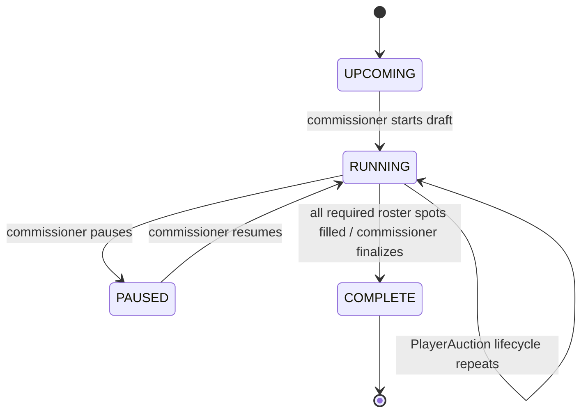

### Draft states

| State | Meaning | Permitted major actions |
|---|---|---|
| UPCOMING | Setup/readiness | imports, roster config, owner prep, media upload |
| RUNNING | Live draft | nomination, bidding, Auto-Agent, Whammy, corrections |
| PAUSED | Draft globally paused | commissioner/recovery actions; no live deadline progression |
| COMPLETE | Final authoritative draft | analytics/export/reconciliation |

---

## 2. Nomination Turn Flow

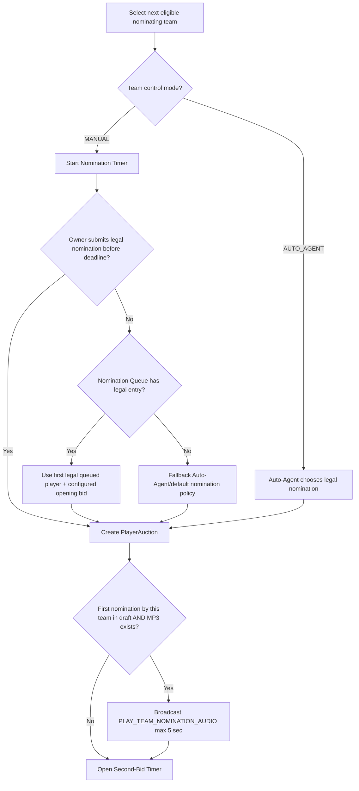

### Nomination rules

- Watch List never auto-nominates.
- Nomination Queue may auto-nominate.
- Opening price may be any legal amount.
- Team nomination audio is presentation-only and does not delay auction opening.
- A team with a complete roster is skipped in future nomination order.

---

## 3. PlayerAuction State Machine

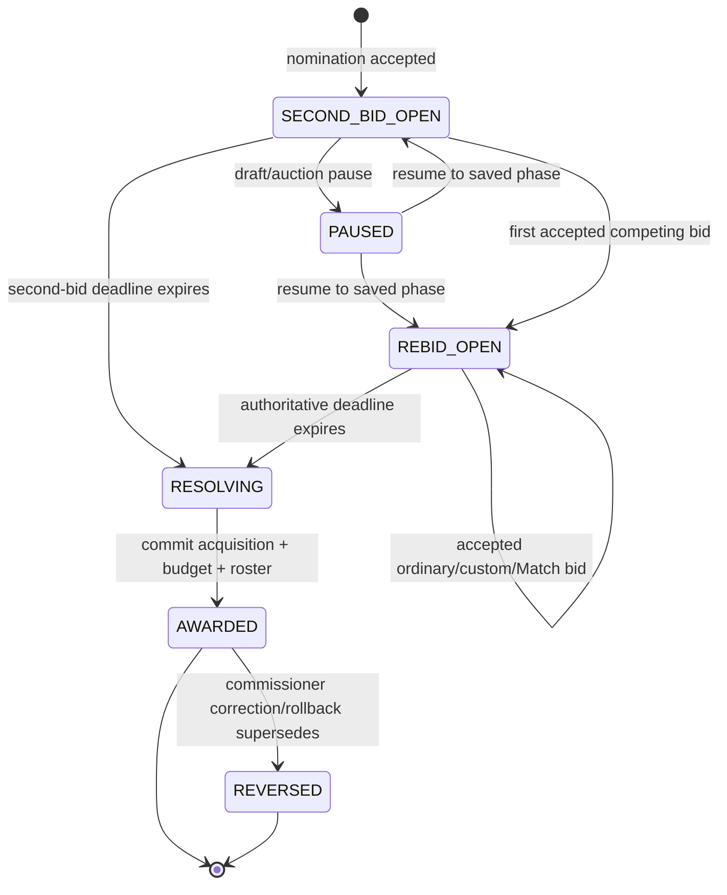

### Resolution when no competing bid exists

If Second-Bid Timer expires with no accepted competing bid:

- nominating team wins;
- price = opening nomination price.

---

## 4. Bid Command Decision Flow

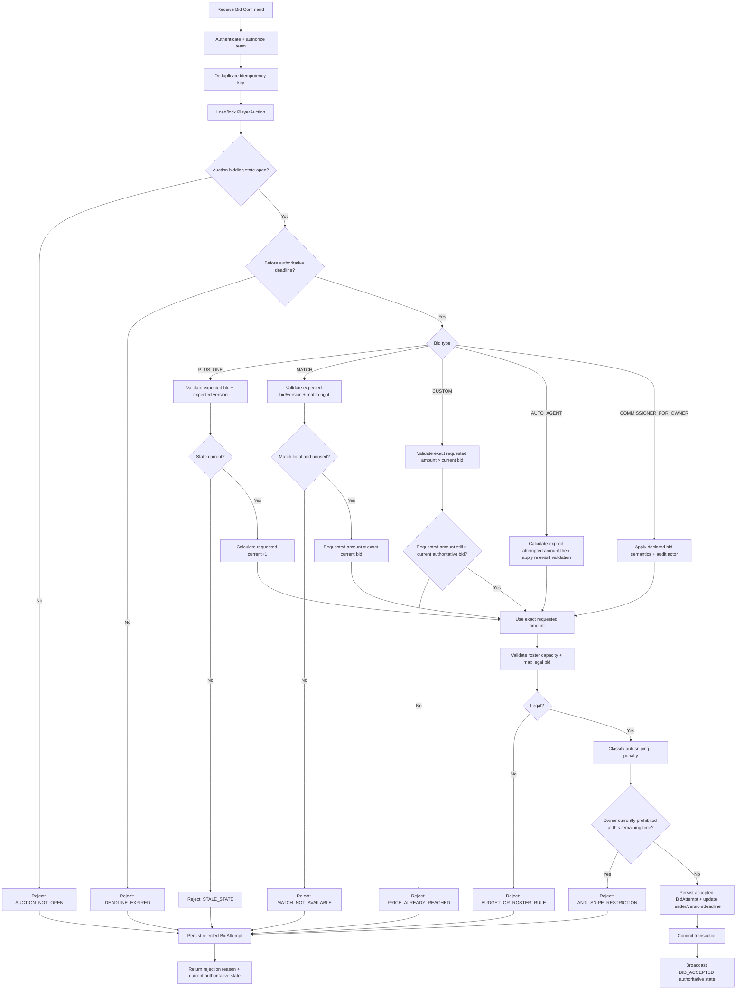

---

## 5. Relative vs Absolute Bid Semantics

| Bid Type | Economic intent | Stale-state rule | Amount behavior |
|---|---|---|---|
| +$1 | "Bid one dollar above what I currently see" | exact current bid + version must match | server calculates displayed current + $1 |
| Match | "Use my one-time right to tie the exact bid I currently see" | exact current bid + version must match | same amount, leader changes |
| Custom | "I offer exactly $X" | exact prior price need not match | accept only if $X still exceeds current bid |
| Auto-Agent | explicit generated offer | must obey same server rules | never exceed calculated willingness |
| Commissioner-for-owner | declared semantics | audited | treated as owner bid with commissioner actor metadata |

---

## 6. Nominator Match State

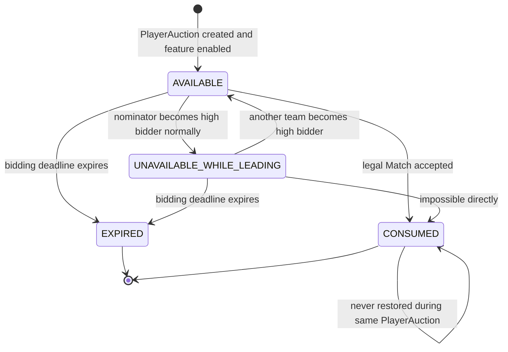

Notes:

- "Unavailable while leading" is a UI/eligibility condition, not a reset of the right.
- Once `CONSUMED`, it stays consumed.
- No post-deadline Match window.

---

## 7. PlayerAuction Resolution Transaction

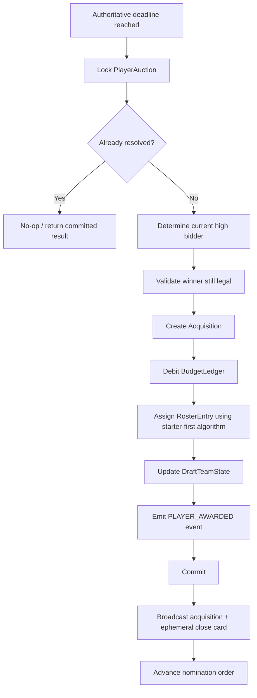

This resolution is itself the undo boundary rollback walks backward through — no separate checkpoint entity is created (§17.5 of `data-model.md`).

---

## 8. Starter-First Roster Assignment Flow

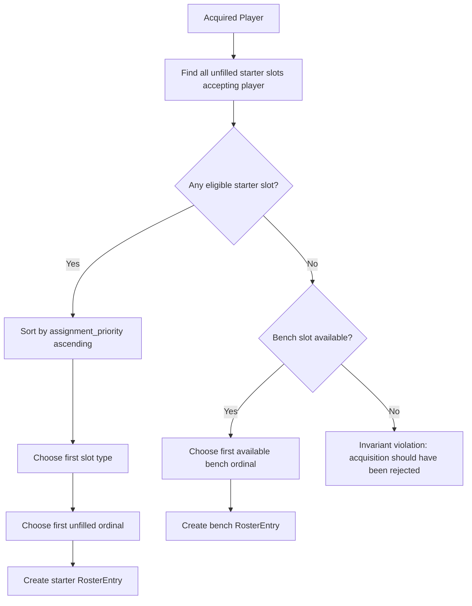

### Examples

```text
Open slots: WR2, OFF_FLEX, Bench
Acquire WR
=> WR2

Open slots: OFF_FLEX, Bench
Acquire WR
=> OFF_FLEX

Open slots: Bench only
Acquire WR
=> Bench
```

No lineup optimization or rearrangement after assignment.

---

## 9. Team Manual / Auto-Agent Control State

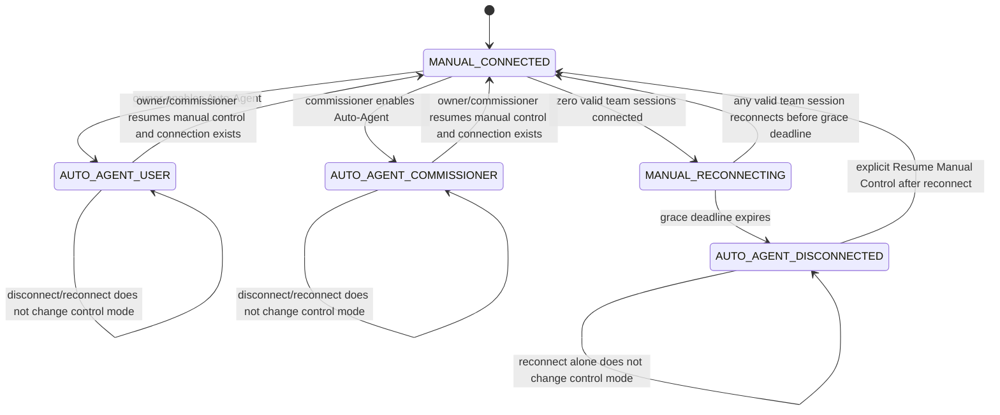

### Transition side effects

Whenever transition enters any `AUTO_AGENT_*` state:

1. update DraftTeamState control mode;
2. record reason;
3. emit immutable DraftEvent;
4. broadcast team Auto-Agent badge/state;
5. broadcast toast to all auction participants.

Example:

> Team Alpha has entered Auto-Agent mode.

Whenever explicit transition returns to manual:

1. update control mode;
2. emit DraftEvent;
3. remove Auto-Agent badge;
4. broadcast toast.

---

## 10. Multi-Window Disconnect Detection

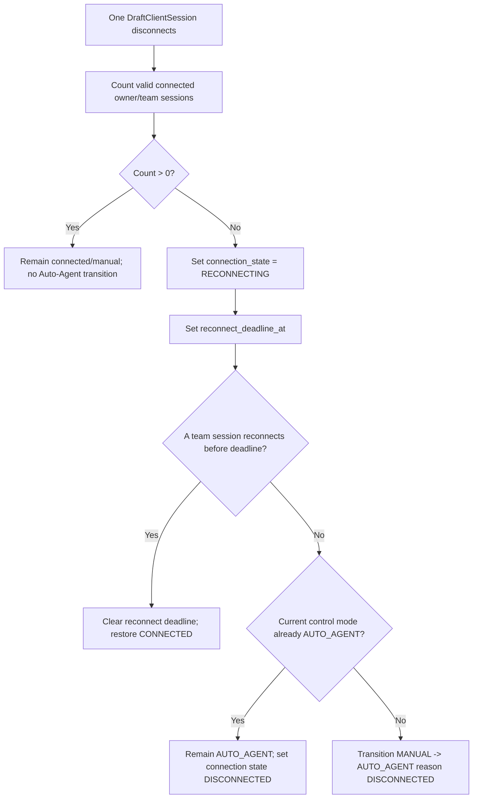

---

## 11. Auto-Agent Offer Calculation

This is intentionally a simple, explainable process.

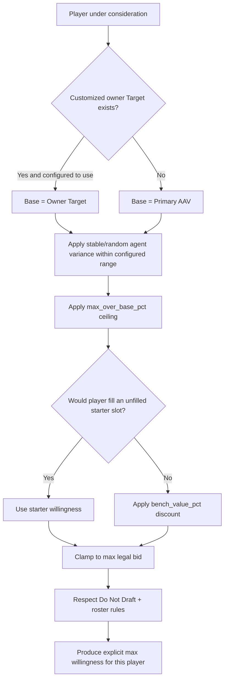

Recommended rule representation:

```yaml
base_value:
  target_if_customized: true
  else: primary_aav

max_over_base_pct: owner_config
random_variance_pct: owner_or_league_config
bench_value_pct: owner_config
prioritize_starters: true
```

The Auto-Agent should be able to explain its ceiling in logs/UI if desired.

---

## 12. Nomination Audio Flow

```mermaid
flowchart TD
    A[Nomination accepted] --> B{Team has MP3?}
    B -->|No| Z[No audio event]
    B -->|Yes| C{first_nomination_audio_played_at is null?}
    C -->|No| Z
    C -->|Yes| D[Atomically mark played_at]
    D --> E[Emit PLAY_TEAM_NOMINATION_AUDIO event]
    E --> F[Clients play from 0 to min(file duration, 5 sec)]
```

Audio failure must not affect auction state.

---

## 13. Pause / Resume

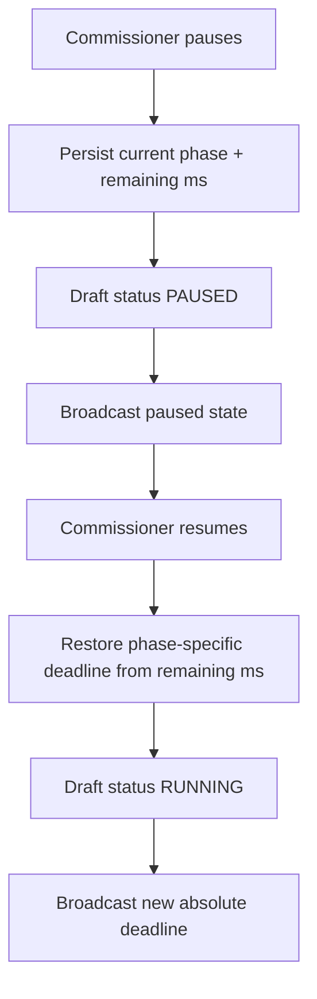

No deadline silently expires while paused.

---

## 14. Commissioner Correction Flow

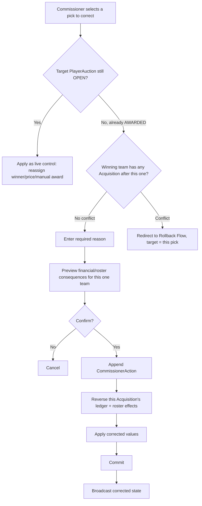

Correction (no-conflict path) touches only the one team and one pick. Live-control edits to the currently open auction are unrestricted (nothing has resolved yet). Never mutate historical BidAttempts.

---

## 15. Rollback Flow

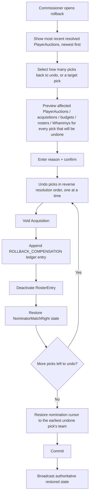

There is one timeline per Draft; rollback never branches it. All undone picks' original events remain in the event log as superseded history. Undoing N picks always undoes the N most recently resolved picks — a commissioner cannot cherry-pick an earlier pick and leave later ones untouched; see §14 for when a single already-awarded pick can be corrected directly instead.

---

## 16. Whammy Flow

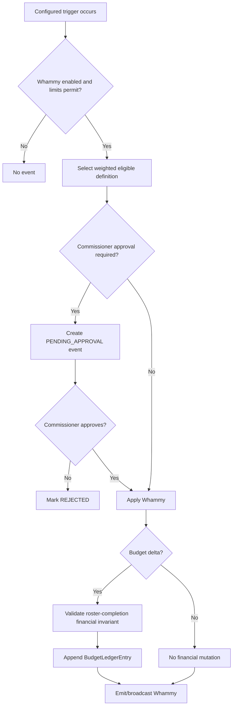

---

## 17. Draft Completion Flow

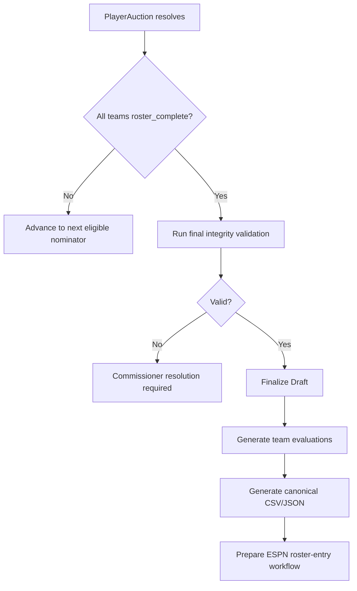

---

## 18. Final Validation Checklist

```yaml
draft_completion_invariants:
  - every required team roster slot is filled
  - every active acquired player belongs to exactly one team
  - no active player acquisition is duplicated
  - each RosterEntry refers to a legal slot for the player
  - each team's roster count equals configured total roster size
  - starter slots and bench counts match configuration
  - active budget ledger reconciles
  - no unresolved commissioner correction exists
  - no PlayerAuction remains open
  - one active DraftTimeline exists
```

---

## 19. Suggested Event Types

```text
DRAFT_SCHEDULED_START_SET
DRAFT_STARTED
DRAFT_PAUSED
DRAFT_RESUMED

NOMINATION_TURN_STARTED
PLAYER_NOMINATED
TEAM_NOMINATION_AUDIO_PLAYED

BID_ATTEMPT_REJECTED
BID_ACCEPTED
MATCH_CONSUMED
AUCTION_DEADLINE_EXTENDED
PLAYER_AWARDED

ROSTER_ENTRY_ASSIGNED
BUDGET_DEBITED
BUDGET_CREDITED

TEAM_RECONNECTING
TEAM_CONNECTION_RESTORED
TEAM_AUTO_AGENT_ENABLED
TEAM_MANUAL_CONTROL_RESUMED

WHAMMY_TRIGGERED
WHAMMY_APPLIED
WHAMMY_REJECTED

COMMISSIONER_CORRECTION
PICK_CORRECTED
ROLLBACK_REQUESTED
ROLLBACK_PICK_UNDONE
ROLLBACK_COMPLETED

DRAFT_COMPLETED
EXPORT_GENERATED
ESPN_RECONCILIATION_UPDATED
DRAFT_SUMMARY_REPORT_GENERATED
DRAFT_SUMMARY_REPORT_EMAILED
```

---

## 20. Recommended Implementation Order

See `BUILD_PLAN.md` for the authoritative phased build plan with acceptance criteria. Summary:

```text
0. Project scaffold + WS protocol envelope (sequence numbers, versioning) from day one
1. Authentication (site/league/team password) + league/roster/scoring configuration + draft scheduling
2. Player master + DraftDataset + CSV ingestion adapter (additional adapters later, parallelizable)
3. Auction Core, as one unit: Draft/DraftTeamState/nomination order (incl. Nomination Queue schema)
   + PlayerAuction state machine + BidAttempt atomicity/timers/stale-state protection
   + Acquisition/BudgetLedger/starter-first RosterEntry
4. Client session/reconnect model, including multi-draft isolation (§23)
5. Manual/Auto-Agent control transitions (incl. AutoAgentConfiguration schema)
6. Owner private strategy data: Watch List, Do Not Draft, Target Values CRUD/UI (parallelizable)
7. Commissioner corrections + rollback (§14, §15) — single-pick correction and LIFO undo-N
8. Whammy framework (parallelizable)
9. Analytics / Draft Summary Report / ESPN reconciliation / presentation polish (parallelizable)
```

---

## 21. Draft Start Scheduling

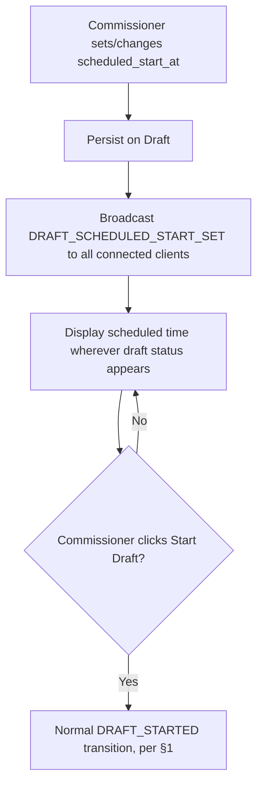

The scheduled time is informational only; it never auto-starts the draft in MVP. If unset, clients display "Not yet scheduled."

---

## 22. Draft Summary Report Generation

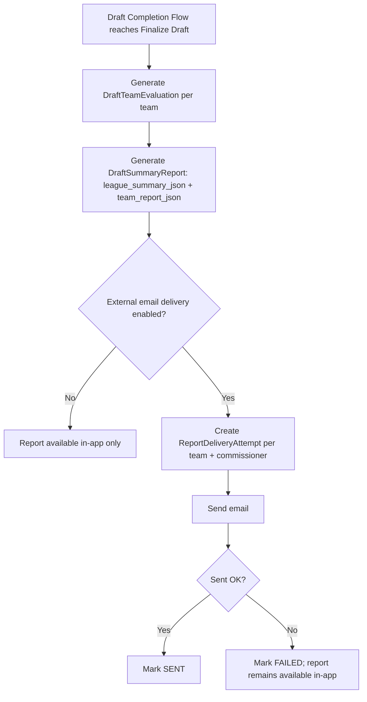

Email delivery failure never removes or blocks in-app report access.

---

## 23. Multi-Draft Isolation

The server process may host more than one RUNNING Draft at a time, across different Leagues (MVP target: at least two concurrently). All in-memory state, timers, nomination cursors, and WebSocket broadcast groups are keyed by `draft_id`; no module-level singleton may hold draft state. A client connects to exactly one draft's event stream at a time (selected during the League/Team login flow, PRD.md §4.4).
